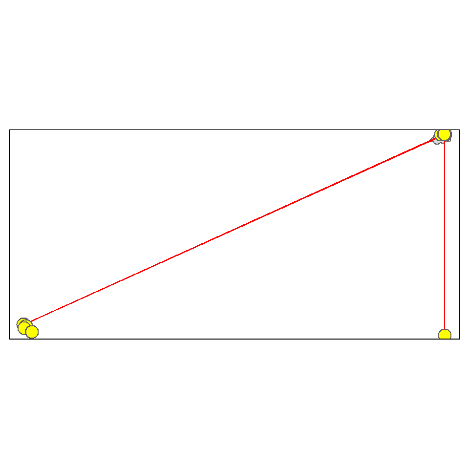
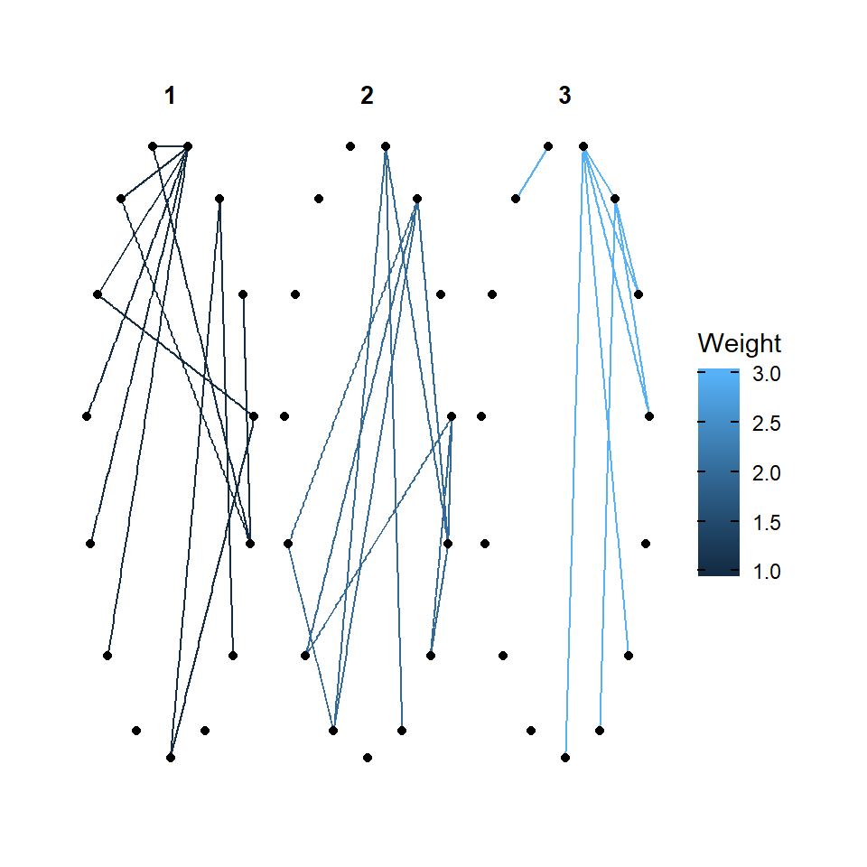

## Introduction
My name is Ananya Chandorkar, I am a 1st year Foundation student who will be pursuing Human Centered Design. I was honored to be in this workshop - Digital Thinking Tools. In this I was introduced to R which initially I found it very difficult but towards the end I saw myself enjoying it and understanding it.

I have chosen 3 dataset. One is the Galton dataset which I worked on earlier. The information is about the family and family members, height, sex. Second data set is about the migration of birds that I worked on this showed what all places/ the route the bird followed. The last dataset is about my favorite tv show - Sherlock Holmes and the connections between him and people around him.


## Graph 1
### Description
Family - The ID of the family.
Father - The height of the father(inches).
Mother - The height of the mother(inches).
Sex - The gender of the child.
Height - The height of the child.
nkids - The number of adult children in the family.


```
## [1] "family" "father" "mother" "sex"    "height" "nkids"
```

```
## Rows: 898
## Columns: 6
## $ family <fct> 1, 1, 1, 1, 2, 2, 2, 2, 3, 3, 4, 4, 4, 4, 4, 5, 5, 5, 5, 5, 5, ~
## $ father <dbl> 78.5, 78.5, 78.5, 78.5, 75.5, 75.5, 75.5, 75.5, 75.0, 75.0, 75.~
## $ mother <dbl> 67.0, 67.0, 67.0, 67.0, 66.5, 66.5, 66.5, 66.5, 64.0, 64.0, 64.~
## $ sex    <fct> M, F, F, F, M, M, F, F, M, F, M, M, F, F, F, M, M, M, F, F, F, ~
## $ height <dbl> 73.2, 69.2, 69.0, 69.0, 73.5, 72.5, 65.5, 65.5, 71.0, 68.0, 70.~
## $ nkids  <int> 4, 4, 4, 4, 4, 4, 4, 4, 2, 2, 5, 5, 5, 5, 5, 6, 6, 6, 6, 6, 6, ~
```
## Description on what I am going to do in my graph
I am going to plot on a question - Does the daughter's and son's height depend on mother's height? I am going to have my x value as 'mother' and y as 'height'.

## Question - Does the doughter's and son's height depend on mother's height?


The graph shows us whether the children's height is dependent on their mothers. I used geom_point to plot my graph.


## Graph 2
### Description
In this I chose my data as 'Lifetrack oilbirds of Costa Rica', this was because I saw that there was data in this which I could use and was easy for me to work with. 

This is the link:
(https://www.movebank.org/cms/webapp?gwt_fragment=page=search_map)

Screenshot of the map:
![] (Lifetrack_Oilbirds_Costa_Rica_map_screenshot.jpg)


```
## Reading layer `lines' from data source 
##   `C:\Users\Arvind\My Drive\R work\MyWebsites\dtt-2021-2022\content\portfolio\Ananya Chandorkar\Data\lines.shp' 
##   using driver `ESRI Shapefile'
## Simple feature collection with 6 features and 1 field (with 2 geometries empty)
## Geometry type: LINESTRING
## Dimension:     XY
## Bounding box:  xmin: -84.8244 ymin: 8.153567 xmax: 9.207567 ymax: 74.04745
## Geodetic CRS:  WGS 84
```

```
## Reading layer `points' from data source 
##   `C:\Users\Arvind\My Drive\R work\MyWebsites\dtt-2021-2022\content\portfolio\Ananya Chandorkar\Data\points.shp' 
##   using driver `ESRI Shapefile'
## Simple feature collection with 4552 features and 62 fields
## Geometry type: POINT
## Dimension:     XY
## Bounding box:  xmin: -84.8244 ymin: 8.153567 xmax: 9.207567 ymax: 74.04745
## Geodetic CRS:  WGS 84
```
## Description on what I am going to do in my graph
In this graph I am going to plot the coordinates of its migration pattern.


```
## Warning: The shape birds_lines contains empty units.
```


## Brief concluding remarks. What does the graph show? What geometric aesthetics did you use, for example?
In this I have used the co-ordinates - Costa Rica and Switzerland. I used the tmap code to come up with this graph.


## Graph 3
### Description
In this we were asked to take any data set of our favorite show/ movie/ novel. I chose my favorite show - Sherlock Holmes. In this we were asked to create our own data set and work using that.


```
## # A tibble: 15 x 3
##    Name               Sex   Episodes
##    <chr>              <chr>    <dbl>
##  1 Sherlock Holmes    M           14
##  2 Doctor John Watson M           14
##  3 Mrs. Hudson        F           14
##  4 Jim Moriarty       M            8
##  5 Mycroft Holmes     M            9
##  6 Irene Adler        F            2
##  7 Mary Watson        F            7
##  8 Molly Hooper       F           13
##  9 Inspector Lestrade M           13
## 10 Euros Holmes       F            3
## 11 Anderson           M            6
## 12 Culverton Smith    M            1
## 13 Kity Riley         F            1
## 14 Mr. Holmes         M            2
## 15 Mrs. Holmes        F            2
```

```
## # A tibble: 34 x 4
##     From    To Weight Type        
##    <dbl> <dbl>  <dbl> <chr>       
##  1     1     2      3 Friend      
##  2     1     4      3 Enemy       
##  3     1     5      2 Family      
##  4     1     3      3 Renter      
##  5     1     7      2 Family      
##  6     1     8      3 Professional
##  7     1     6      3 Lovers      
##  8     1     9      2 Professional
##  9     1    10      1 Family      
## 10     1    11      1 Professional
## # ... with 24 more rows
```


## Description on what I am going to do in my graph
I wanted to facet the information according to the relationship they share with each other and the type of bond also that they share with each other.


## faceting according to the type of bond they shared with eachother and the bonding they share between eachother

```
## Warning in grid.Call(C_stringMetric, as.graphicsAnnot(x$label)): font family not
## found in Windows font database
```

```
## Warning in grid.Call(C_textBounds, as.graphicsAnnot(x$label), x$x, x$y, : font
## family not found in Windows font database
```

```
## Warning in grid.Call(C_stringMetric, as.graphicsAnnot(x$label)): font family not
## found in Windows font database

## Warning in grid.Call(C_stringMetric, as.graphicsAnnot(x$label)): font family not
## found in Windows font database
```

```
## Warning in grid.Call.graphics(C_text, as.graphicsAnnot(x$label), x$x, x$y, :
## font family not found in Windows font database
```

```
## Warning in grid.Call(C_textBounds, as.graphicsAnnot(x$label), x$x, x$y, : font
## family not found in Windows font database

## Warning in grid.Call(C_textBounds, as.graphicsAnnot(x$label), x$x, x$y, : font
## family not found in Windows font database
```


```
## Warning in grid.Call(C_textBounds, as.graphicsAnnot(x$label), x$x, x$y, : font
## family not found in Windows font database

## Warning in grid.Call(C_textBounds, as.graphicsAnnot(x$label), x$x, x$y, : font
## family not found in Windows font database

## Warning in grid.Call(C_textBounds, as.graphicsAnnot(x$label), x$x, x$y, : font
## family not found in Windows font database
```

```
## Warning in grid.Call.graphics(C_text, as.graphicsAnnot(x$label), x$x, x$y, :
## font family not found in Windows font database
```

```
## Warning in grid.Call(C_textBounds, as.graphicsAnnot(x$label), x$x, x$y, : font
## family not found in Windows font database

## Warning in grid.Call(C_textBounds, as.graphicsAnnot(x$label), x$x, x$y, : font
## family not found in Windows font database
```


## Brief concluding remarks. What does the graph show? What geometric aesthetics did you use, for example?
I have used faceting. In this I chose to have one kind of layout, but with two different information. Their are two kind of graphs. 


## My Course Reflection
Initially it was really difficult for me to understand the codes and catch up with the class. I was also scared to approach people as I thought that I was not good enough as they were, in this I forgot the main aim of the workshop is to help me as an individual person. Eventually I got the hang of the graph. I did not participate much as I was still overcoming my barrier. I also felt that I was slow and could not finish all the work, I have to work on my speed.
Towards the end I had gained full confidence. For the Task 7 which was on Networks. In this we had to choose a show/ movie/ novel of our choice. I paired up with Ashwath. We both could not find a common show but later we decided to work with - BBC Sherlock Holmes show, the famous detective show. While working (not to be rude) my teammate did not contribute at all. I made the data set in Excel and imported it in Rmd file. After this I saw that the file was not being read as an error was showing. So later I saw how the other file which we learnt our code on (Grey's Anatomy) was done and filled my excel sheet accordingly. I also made a list of what were nodes and edges in the data set I had come up with to be sure. Later I started making the graphs after importing it. I made 4 graphs in total. One was the 'autograph' map which I made to cross check my data, if it shows any error, I was planning to remove it but it looked really nice and was part of my exploration and therefore left it. Later I wanted to show the bonding between Sherlock Holmes and other members of the family/ characters in the show with each other. For this I used ggraph, circular graph to represent the data. Later I wanted to use faceting, so I faceted according to the type of bond they shared with each other and the bonding they share between each other. I did this for weight and type which gave me different graphs. 
In the end we were asked to compile our work. In which I chose my 3 graphs and compiled those. Towards the end I felt very proud of myself for doing the work all by myself, I gained the confidence. At the same time I was sad that my team mate did not put in an effort to work. He did not show any interest, when I requested him to help me with the graphs he said that he knows nothing and that I complete the graph and send him all the files with the Rmd file. I just wished he had participated abit. 
