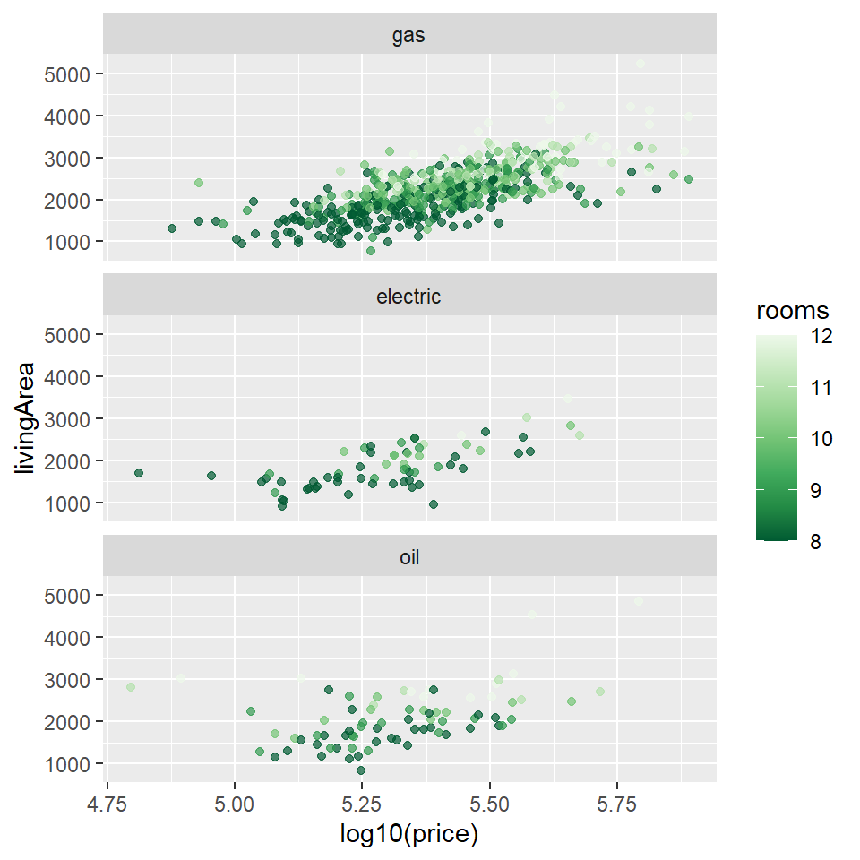
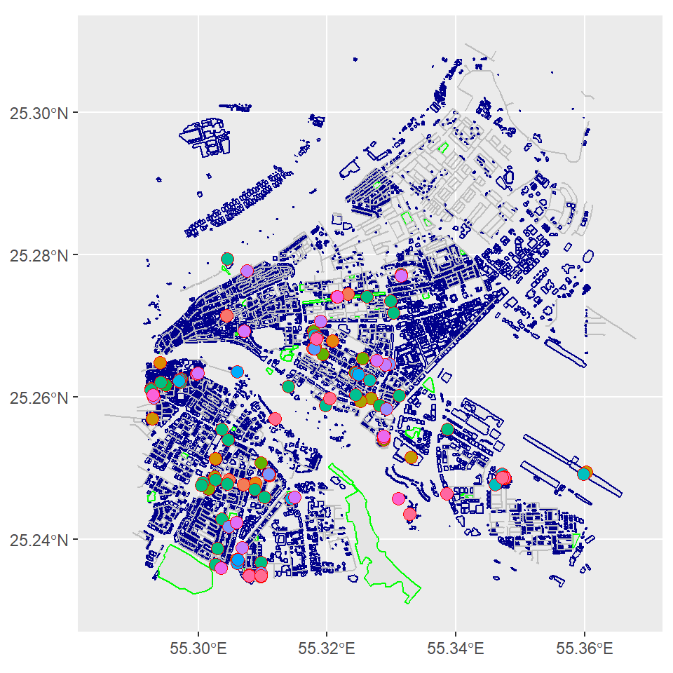

## Introduction

> Hey, I am Annie. I am that person who will keep running the code over and over again until I get it right. I am majoring in Creative and Applied Computations, below are the works I enjoyed doing the most.  
> show here.

## Graph 1

This network graph is based on the 2021 movie Don't Look Up, starring Leonardo DiCaprio, Jennifer Lawerence, Meryl Streep and much more. The interactions between the main characters were logged and counted, it is based on that data that was built from ground up the graphs were made.


```
## # A tibble: 19 x 4
##    Name  Sex   Race       Position        
##    <chr> <chr> <chr>      <chr>           
##  1 RM001 M     White      Professor       
##  2 KD002 F     Slavic     Phdstudent      
##  3 RB003 F     White      singer          
##  4 Y004  M     White      Kate's boyfriend
##  5 PO005 F     White      President       
##  6 DO006 M     Black      head of TPDC    
##  7 JO007 M     White      President's son 
##  8 PI008 M     White      CEO of bash     
##  9 JB009 M     Black      TV host         
## 10 BE010 F     Australian TV host         
## 11 DC011 M     Black      singer          
## 12 P012  M     Indian     Journalist      
## 13 JM013 F     European   w/o Randal      
## 14 AG014 M     Black      Journalist      
## 15 GT015 M     <NA>       <NA>            
## 16 DC016 F     Asian      Head of NASA    
## 17 EM017 M     White      <NA>            
## 18 BD018 M     White      Astronaut       
## 19 MM019 M     White      <NA>
```

```
## # A tibble: 39 x 4
##    from  to    weight `relation type`
##    <chr> <chr>  <dbl> <chr>          
##  1 AG014 RM001      2 situational    
##  2 AG014 KD002      1 situational    
##  3 BE010 JB009      6 professional   
##  4 BE010 RB003      1 situational    
##  5 BE010 RM001     10 benefits       
##  6 BE010 PI008      1 friends        
##  7 BE010 JM013      1 situational    
##  8 DC016 RM001      1 professional   
##  9 DC016 DO006      1 professional   
## 10 DO006 GT015      2 professional   
## # ... with 29 more rows
```

```
## # A tibble: 19 x 5
##       id label group  Race       Position        
##    <int> <chr> <chr>  <chr>      <chr>           
##  1     1 RM001 Male   White      Professor       
##  2     2 KD002 Female Slavic     Phdstudent      
##  3     3 RB003 Female White      singer          
##  4     4 Y004  Male   White      Kate's boyfriend
##  5     5 PO005 Female White      President       
##  6     6 DO006 Male   Black      head of TPDC    
##  7     7 JO007 Male   White      President's son 
##  8     8 PI008 Male   White      CEO of bash     
##  9     9 JB009 Male   Black      TV host         
## 10    10 BE010 Female Australian TV host         
## 11    11 DC011 Male   Black      singer          
## 12    12 P012  Male   Indian     Journalist      
## 13    13 JM013 Female European   w/o Randal      
## 14    14 AG014 Male   Black      Journalist      
## 15    15 GT015 Male   <NA>       <NA>            
## 16    16 DC016 Female Asian      Head of NASA    
## 17    17 EM017 Male   White      <NA>            
## 18    18 BD018 Male   White      Astronaut       
## 19    19 MM019 Male   White      <NA>
```

```
## # A tibble: 39 x 2
##     from    to
##    <int> <int>
##  1    14     1
##  2    14     2
##  3    10     9
##  4    10     3
##  5    10     1
##  6    10     8
##  7    10    13
##  8    16     1
##  9    16     6
## 10     6    15
## # ... with 29 more rows
```


This is an interactive network graph that shows the relations between all the characters in the movie. The graph shows the females in a red colour with the icon and male with the blue icon.


```{=html}
<div id="htmlwidget-86f72ed5af04409aeb45" style="width:480px;height:480px;" class="visNetwork html-widget"></div>
<script type="application/json" data-for="htmlwidget-86f72ed5af04409aeb45">{"x":{"nodes":{"id":[1,2,3,4,5,6,7,8,9,10,11,12,13,14,15,16,17,18,19],"label":["RM001","KD002","RB003","Y004","PO005","DO006","JO007","PI008","JB009","BE010","DC011","P012","JM013","AG014","GT015","DC016","EM017","BD018","MM019"],"group":["Male","Female","Female","Male","Female","Male","Male","Male","Male","Female","Male","Male","Female","Male","Male","Female","Male","Male","Male"],"Race":["White","Slavic","White","White","White","Black","White","White","Black","Australian","Black","Indian","European","Black",null,"Asian","White","White","White"],"Position":["Professor","Phdstudent","singer","Kate's boyfriend","President","head of TPDC","President's son","CEO of bash","TV host","TV host","singer","Journalist","w/o Randal","Journalist",null,"Head of NASA",null,"Astronaut",null]},"edges":{"from":[14,14,10,10,10,10,10,16,16,6,6,17,15,15,9,9,7,7,7,13,13,2,2,2,2,19,8,12,12,5,5,5,5,5,5,5,3,3,4],"to":[1,2,9,3,1,8,13,1,6,15,1,1,1,2,1,2,6,1,2,1,4,6,1,4,13,1,1,2,1,18,8,1,6,2,16,7,11,1,1]},"nodesToDataframe":true,"edgesToDataframe":true,"options":{"width":"100%","height":"100%","nodes":{"shape":"dot","font":{"size":15}},"manipulation":{"enabled":false},"groups":{"Female":{"shape":"icon","icon":{"code":"f182","size":30,"color":"red"},"shadow":{"enabled":true}},"useDefaultGroups":true,"Male":{"shape":"icon","icon":{"code":"f183","size":30,"color":"blue"},"shadow":{"enabled":true}}},"interaction":{"hover":true,"hoverConnectedEdges":true,"navigationButtons":true,"selectConnectedEdges":true,"zoomView":true,"zoomSpeed":1}},"groups":["Male","Female"],"width":null,"height":null,"idselection":{"enabled":false},"byselection":{"enabled":false},"main":null,"submain":null,"footer":null,"background":"rgba(0, 0, 0, 0)","iconsRedraw":true,"tooltipStay":300,"tooltipStyle":"position: fixed;visibility:hidden;padding: 5px;white-space: nowrap;font-family: verdana;font-size:14px;font-color:#000000;background-color: #f5f4ed;-moz-border-radius: 3px;-webkit-border-radius: 3px;border-radius: 3px;border: 1px solid #808074;box-shadow: 3px 3px 10px rgba(0, 0, 0, 0.2);"},"evals":[],"jsHooks":[]}</script>
```

The graph mechanism works with nodes (dots) and edges (lines) where the line shows the link between the characters and the nodes in itself are the characters. We had given each character an alphanumeric code to make the graph more readable.

## Graph 2

This graph is based on the data of houses in Saratoga. It was a dataset that was premade and I worked on it to answer some questions.


```
##  [1] "price"           "lotSize"         "age"             "landValue"      
##  [5] "livingArea"      "pctCollege"      "bedrooms"        "fireplaces"     
##  [9] "bathrooms"       "rooms"           "heating"         "fuel"           
## [13] "sewer"           "waterfront"      "newConstruction" "centralAir"
```

```
## [1] 1728   16
```

```
##      price           lotSize             age           landValue     
##  Min.   :  5000   Min.   : 0.0000   Min.   :  0.00   Min.   :   200  
##  1st Qu.:145000   1st Qu.: 0.1700   1st Qu.: 13.00   1st Qu.: 15100  
##  Median :189900   Median : 0.3700   Median : 19.00   Median : 25000  
##  Mean   :211967   Mean   : 0.5002   Mean   : 27.92   Mean   : 34557  
##  3rd Qu.:259000   3rd Qu.: 0.5400   3rd Qu.: 34.00   3rd Qu.: 40200  
##  Max.   :775000   Max.   :12.2000   Max.   :225.00   Max.   :412600  
##    livingArea     pctCollege       bedrooms       fireplaces       bathrooms  
##  Min.   : 616   Min.   :20.00   Min.   :1.000   Min.   :0.0000   Min.   :0.0  
##  1st Qu.:1300   1st Qu.:52.00   1st Qu.:3.000   1st Qu.:0.0000   1st Qu.:1.5  
##  Median :1634   Median :57.00   Median :3.000   Median :1.0000   Median :2.0  
##  Mean   :1755   Mean   :55.57   Mean   :3.155   Mean   :0.6019   Mean   :1.9  
##  3rd Qu.:2138   3rd Qu.:64.00   3rd Qu.:4.000   3rd Qu.:1.0000   3rd Qu.:2.5  
##  Max.   :5228   Max.   :82.00   Max.   :7.000   Max.   :4.0000   Max.   :4.5  
##      rooms                   heating           fuel     
##  Min.   : 2.000   hot air        :1121   gas     :1197  
##  1st Qu.: 5.000   hot water/steam: 302   electric: 315  
##  Median : 7.000   electric       : 305   oil     : 216  
##  Mean   : 7.042                                         
##  3rd Qu.: 8.250                                         
##  Max.   :12.000                                         
##                sewer      waterfront newConstruction centralAir
##  septic           : 503   Yes:  15   Yes:  81        Yes: 635  
##  public/commercial:1213   No :1713   No :1647        No :1093  
##  none             :  12                                        
##                                                                
##                                                                
## 
```

This scatter plot graph answers the question "What is the change in price with the living area?" 



Plotting 1728 houses in Saratoga with dots was difficult and almost impossible to read. So, I filtered the data to include only houses with more than seven rooms to compare the change in price as the living are increases. The graph is colour-coded by the number of rooms and faceted by the kinds of fuels.

## Graph 3

Brief introduction of your chosen data set Describe the interesting
columns and what they mean


```
## Reading layer `restaurants' from data source 
##   `C:\Users\Arvind\My Drive\R work\MyWebsites\dtt-2021-2022\content\portfolio\Annie Vaithara\restaurants.gpkg' 
##   using driver `GPKG'
## Simple feature collection with 710 features and 60 fields
## Geometry type: POINT
## Dimension:     XY
## Bounding box:  xmin: 55.29257 ymin: 25.23481 xmax: 55.36024 ymax: 25.29242
## Geodetic CRS:  WGS 84
```

```
## Reading layer `buildings' from data source 
##   `C:\Users\Arvind\My Drive\R work\MyWebsites\dtt-2021-2022\content\portfolio\Annie Vaithara\buildings.gpkg' 
##   using driver `GPKG'
## Simple feature collection with 7794 features and 121 fields
## Geometry type: POLYGON
## Dimension:     XY
## Bounding box:  xmin: 55.29125 ymin: 25.23325 xmax: 55.36581 ymax: 25.30777
## Geodetic CRS:  WGS 84
```

```
## Reading layer `parks' from data source 
##   `C:\Users\Arvind\My Drive\R work\MyWebsites\dtt-2021-2022\content\portfolio\Annie Vaithara\parks.gpkg' 
##   using driver `GPKG'
## Simple feature collection with 36 features and 19 fields
## Geometry type: POLYGON
## Dimension:     XY
## Bounding box:  xmin: 55.29204 ymin: 25.23094 xmax: 55.3593 ymax: 25.29573
## Geodetic CRS:  WGS 84
```

```
## Reading layer `roads' from data source 
##   `C:\Users\Arvind\My Drive\R work\MyWebsites\dtt-2021-2022\content\portfolio\Annie Vaithara\roads.gpkg' 
##   using driver `GPKG'
## Simple feature collection with 1750 features and 34 fields
## Geometry type: LINESTRING
## Dimension:     XY
## Bounding box:  xmin: 55.28545 ymin: 25.23379 xmax: 55.36798 ymax: 25.30962
## Geodetic CRS:  WGS 84
```

```
## [1] 710
```

```
##  [1] "osm_id"              "name"                "addr.city"          
##  [4] "addr.city.ar"        "addr.housename"      "addr.housenumber"   
##  [7] "addr.street"         "addr.street.ar"      "air_conditioning"   
## [10] "amenity"             "brand"               "brand.ar"           
## [13] "brand.wikidata"      "brand.wikipedia"     "brand.wikipedia.ar" 
## [16] "buffet"              "contact.email"       "contact.facebook"   
## [19] "contact.instagram"   "contact.linkedin"    "contact.phone"      
## [22] "contact.twitter"     "contact.website"     "contact.youtube"    
## [25] "cuisine"             "delivery"            "description"        
## [28] "diet.halal"          "diet.vegetarian"     "email"              
## [31] "fixme"               "internet_access"     "internet_access.fee"
## [34] "name.am"             "name.ar"             "name.en"            
## [37] "name.fa"             "name.fr"             "name.ja"            
## [40] "name.km"             "name.ko"             "name.pa"            
## [43] "name.ps"             "name.ru"             "name.ur"            
## [46] "name.zh"             "note"                "official_name"      
## [49] "opening_hours"       "operator"            "outdoor_seating"    
## [52] "parking"             "phone"               "shop"               
## [55] "smoking"             "source"              "takeaway"           
## [58] "website"             "wheelchair"          "wifi"               
## [61] "geom"
```

```
##   [1] "afghan"                                                                        
##   [2] "Iraq"                                                                          
##   [3] NA                                                                              
##   [4] NA                                                                              
##   [5] NA                                                                              
##   [6] NA                                                                              
##   [7] NA                                                                              
##   [8] NA                                                                              
##   [9] NA                                                                              
##  [10] NA                                                                              
##  [11] NA                                                                              
##  [12] "regional"                                                                      
##  [13] "regional"                                                                      
##  [14] "international"                                                                 
##  [15] "indian"                                                                        
##  [16] NA                                                                              
##  [17] NA                                                                              
##  [18] "indian"                                                                        
##  [19] "indian"                                                                        
##  [20] "indian"                                                                        
##  [21] "Gujarati_Thali"                                                                
##  [22] "indian"                                                                        
##  [23] "South_Indian"                                                                  
##  [24] "indian"                                                                        
##  [25] "persian;buffet"                                                                
##  [26] "indian"                                                                        
##  [27] "indian"                                                                        
##  [28] "indian"                                                                        
##  [29] "juices; pakistani"                                                             
##  [30] NA                                                                              
##  [31] NA                                                                              
##  [32] NA                                                                              
##  [33] "regional_-Soth_India"                                                          
##  [34] NA                                                                              
##  [35] NA                                                                              
##  [36] NA                                                                              
##  [37] NA                                                                              
##  [38] NA                                                                              
##  [39] "chinese"                                                                       
##  [40] "chinese"                                                                       
##  [41] "turkish"                                                                       
##  [42] "indian"                                                                        
##  [43] "indian"                                                                        
##  [44] "indian"                                                                        
##  [45] "arab"                                                                          
##  [46] NA                                                                              
##  [47] NA                                                                              
##  [48] NA                                                                              
##  [49] NA                                                                              
##  [50] "shawarma"                                                                      
##  [51] NA                                                                              
##  [52] NA                                                                              
##  [53] NA                                                                              
##  [54] NA                                                                              
##  [55] "Organic_Beef_Burgers"                                                          
##  [56] "chicken;portuguese"                                                            
##  [57] NA                                                                              
##  [58] NA                                                                              
##  [59] NA                                                                              
##  [60] NA                                                                              
##  [61] NA                                                                              
##  [62] NA                                                                              
##  [63] "pizza"                                                                         
##  [64] "regional"                                                                      
##  [65] NA                                                                              
##  [66] "Pakistani_/_Chinese_cuisine"                                                   
##  [67] "continental;italian"                                                           
##  [68] "indian;chinese;continental"                                                    
##  [69] "Hyderabadi_Indian_Cuisine"                                                     
##  [70] NA                                                                              
##  [71] "burger"                                                                        
##  [72] NA                                                                              
##  [73] NA                                                                              
##  [74] NA                                                                              
##  [75] NA                                                                              
##  [76] NA                                                                              
##  [77] NA                                                                              
##  [78] NA                                                                              
##  [79] NA                                                                              
##  [80] NA                                                                              
##  [81] NA                                                                              
##  [82] NA                                                                              
##  [83] NA                                                                              
##  [84] NA                                                                              
##  [85] NA                                                                              
##  [86] NA                                                                              
##  [87] "indian"                                                                        
##  [88] "pakistani"                                                                     
##  [89] "indian"                                                                        
##  [90] NA                                                                              
##  [91] "fish_and_chips"                                                                
##  [92] "lebanese"                                                                      
##  [93] "juice"                                                                         
##  [94] "regional;shawarma"                                                             
##  [95] "indian"                                                                        
##  [96] "regional"                                                                      
##  [97] "indian"                                                                        
##  [98] NA                                                                              
##  [99] NA                                                                              
## [100] "japanese"                                                                      
## [101] "international"                                                                 
## [102] NA                                                                              
## [103] NA                                                                              
## [104] "italian"                                                                       
## [105] "thai"                                                                          
## [106] "seafood"                                                                       
## [107] "chinese"                                                                       
## [108] NA                                                                              
## [109] "steak"                                                                         
## [110] NA                                                                              
## [111] "pakistani"                                                                     
## [112] NA                                                                              
## [113] NA                                                                              
## [114] NA                                                                              
## [115] NA                                                                              
## [116] NA                                                                              
## [117] NA                                                                              
## [118] NA                                                                              
## [119] NA                                                                              
## [120] NA                                                                              
## [121] NA                                                                              
## [122] NA                                                                              
## [123] NA                                                                              
## [124] NA                                                                              
## [125] NA                                                                              
## [126] NA                                                                              
## [127] NA                                                                              
## [128] NA                                                                              
## [129] NA                                                                              
## [130] NA                                                                              
## [131] NA                                                                              
## [132] "indian"                                                                        
## [133] NA                                                                              
## [134] NA                                                                              
## [135] NA                                                                              
## [136] NA                                                                              
## [137] NA                                                                              
## [138] NA                                                                              
## [139] NA                                                                              
## [140] NA                                                                              
## [141] NA                                                                              
## [142] NA                                                                              
## [143] NA                                                                              
## [144] "chinese"                                                                       
## [145] NA                                                                              
## [146] NA                                                                              
## [147] NA                                                                              
## [148] NA                                                                              
## [149] "seafood"                                                                       
## [150] "seafood"                                                                       
## [151] "filipino"                                                                      
## [152] "filipino"                                                                      
## [153] "grill"                                                                         
## [154] NA                                                                              
## [155] NA                                                                              
## [156] NA                                                                              
## [157] NA                                                                              
## [158] NA                                                                              
## [159] NA                                                                              
## [160] NA                                                                              
## [161] NA                                                                              
## [162] NA                                                                              
## [163] NA                                                                              
## [164] NA                                                                              
## [165] NA                                                                              
## [166] NA                                                                              
## [167] NA                                                                              
## [168] NA                                                                              
## [169] "ice_cream"                                                                     
## [170] "juices"                                                                        
## [171] NA                                                                              
## [172] NA                                                                              
## [173] NA                                                                              
## [174] NA                                                                              
## [175] "international;ice_cream;seafood;coffee_shop;asian;arab;kebab;indian"           
## [176] "korean"                                                                        
## [177] NA                                                                              
## [178] NA                                                                              
## [179] NA                                                                              
## [180] NA                                                                              
## [181] NA                                                                              
## [182] "regional"                                                                      
## [183] NA                                                                              
## [184] NA                                                                              
## [185] NA                                                                              
## [186] "chinese"                                                                       
## [187] NA                                                                              
## [188] NA                                                                              
## [189] "african"                                                                       
## [190] "pakistani"                                                                     
## [191] "filipino"                                                                      
## [192] NA                                                                              
## [193] NA                                                                              
## [194] NA                                                                              
## [195] NA                                                                              
## [196] NA                                                                              
## [197] NA                                                                              
## [198] NA                                                                              
## [199] NA                                                                              
## [200] NA                                                                              
## [201] NA                                                                              
## [202] NA                                                                              
## [203] NA                                                                              
## [204] NA                                                                              
## [205] NA                                                                              
## [206] NA                                                                              
## [207] NA                                                                              
## [208] NA                                                                              
## [209] NA                                                                              
## [210] NA                                                                              
## [211] NA                                                                              
## [212] NA                                                                              
## [213] NA                                                                              
## [214] NA                                                                              
## [215] NA                                                                              
## [216] NA                                                                              
## [217] NA                                                                              
## [218] NA                                                                              
## [219] NA                                                                              
## [220] NA                                                                              
## [221] NA                                                                              
## [222] NA                                                                              
## [223] NA                                                                              
## [224] NA                                                                              
## [225] "breakfast;indian"                                                              
## [226] NA                                                                              
## [227] NA                                                                              
## [228] NA                                                                              
## [229] NA                                                                              
## [230] NA                                                                              
## [231] NA                                                                              
## [232] NA                                                                              
## [233] NA                                                                              
## [234] NA                                                                              
## [235] NA                                                                              
## [236] NA                                                                              
## [237] NA                                                                              
## [238] NA                                                                              
## [239] NA                                                                              
## [240] NA                                                                              
## [241] NA                                                                              
## [242] NA                                                                              
## [243] NA                                                                              
## [244] NA                                                                              
## [245] NA                                                                              
## [246] NA                                                                              
## [247] NA                                                                              
## [248] NA                                                                              
## [249] NA                                                                              
## [250] NA                                                                              
## [251] NA                                                                              
## [252] NA                                                                              
## [253] NA                                                                              
## [254] NA                                                                              
## [255] NA                                                                              
## [256] NA                                                                              
## [257] NA                                                                              
## [258] NA                                                                              
## [259] NA                                                                              
## [260] NA                                                                              
## [261] NA                                                                              
## [262] NA                                                                              
## [263] NA                                                                              
## [264] NA                                                                              
## [265] NA                                                                              
## [266] NA                                                                              
## [267] NA                                                                              
## [268] NA                                                                              
## [269] NA                                                                              
## [270] NA                                                                              
## [271] NA                                                                              
## [272] NA                                                                              
## [273] NA                                                                              
## [274] NA                                                                              
## [275] NA                                                                              
## [276] NA                                                                              
## [277] NA                                                                              
## [278] NA                                                                              
## [279] NA                                                                              
## [280] NA                                                                              
## [281] NA                                                                              
## [282] NA                                                                              
## [283] NA                                                                              
## [284] NA                                                                              
## [285] NA                                                                              
## [286] NA                                                                              
## [287] NA                                                                              
## [288] NA                                                                              
## [289] NA                                                                              
## [290] NA                                                                              
## [291] NA                                                                              
## [292] NA                                                                              
## [293] NA                                                                              
## [294] NA                                                                              
## [295] NA                                                                              
## [296] NA                                                                              
## [297] NA                                                                              
## [298] NA                                                                              
## [299] NA                                                                              
## [300] NA                                                                              
## [301] NA                                                                              
## [302] NA                                                                              
## [303] NA                                                                              
## [304] NA                                                                              
## [305] NA                                                                              
## [306] NA                                                                              
## [307] NA                                                                              
## [308] NA                                                                              
## [309] NA                                                                              
## [310] NA                                                                              
## [311] NA                                                                              
## [312] NA                                                                              
## [313] NA                                                                              
## [314] NA                                                                              
## [315] NA                                                                              
## [316] NA                                                                              
## [317] NA                                                                              
## [318] NA                                                                              
## [319] NA                                                                              
## [320] "iraqui"                                                                        
## [321] NA                                                                              
## [322] NA                                                                              
## [323] NA                                                                              
## [324] NA                                                                              
## [325] NA                                                                              
## [326] NA                                                                              
## [327] NA                                                                              
## [328] NA                                                                              
## [329] NA                                                                              
## [330] NA                                                                              
## [331] "american"                                                                      
## [332] NA                                                                              
## [333] NA                                                                              
## [334] NA                                                                              
## [335] NA                                                                              
## [336] NA                                                                              
## [337] NA                                                                              
## [338] NA                                                                              
## [339] NA                                                                              
## [340] NA                                                                              
## [341] NA                                                                              
## [342] NA                                                                              
## [343] NA                                                                              
## [344] NA                                                                              
## [345] NA                                                                              
## [346] NA                                                                              
## [347] NA                                                                              
## [348] NA                                                                              
## [349] NA                                                                              
## [350] NA                                                                              
## [351] NA                                                                              
## [352] NA                                                                              
## [353] NA                                                                              
## [354] NA                                                                              
## [355] NA                                                                              
## [356] NA                                                                              
## [357] NA                                                                              
## [358] NA                                                                              
## [359] NA                                                                              
## [360] NA                                                                              
## [361] NA                                                                              
## [362] NA                                                                              
## [363] NA                                                                              
## [364] NA                                                                              
## [365] NA                                                                              
## [366] NA                                                                              
## [367] NA                                                                              
## [368] NA                                                                              
## [369] NA                                                                              
## [370] NA                                                                              
## [371] NA                                                                              
## [372] NA                                                                              
## [373] NA                                                                              
## [374] NA                                                                              
## [375] NA                                                                              
## [376] NA                                                                              
## [377] NA                                                                              
## [378] NA                                                                              
## [379] NA                                                                              
## [380] NA                                                                              
## [381] NA                                                                              
## [382] NA                                                                              
## [383] NA                                                                              
## [384] NA                                                                              
## [385] NA                                                                              
## [386] NA                                                                              
## [387] "indian"                                                                        
## [388] NA                                                                              
## [389] NA                                                                              
## [390] NA                                                                              
## [391] NA                                                                              
## [392] NA                                                                              
## [393] NA                                                                              
## [394] NA                                                                              
## [395] NA                                                                              
## [396] NA                                                                              
## [397] NA                                                                              
## [398] NA                                                                              
## [399] NA                                                                              
## [400] NA                                                                              
## [401] NA                                                                              
## [402] NA                                                                              
## [403] NA                                                                              
## [404] "tex-mex"                                                                       
## [405] NA                                                                              
## [406] NA                                                                              
## [407] NA                                                                              
## [408] NA                                                                              
## [409] NA                                                                              
## [410] NA                                                                              
## [411] NA                                                                              
## [412] NA                                                                              
## [413] NA                                                                              
## [414] NA                                                                              
## [415] NA                                                                              
## [416] NA                                                                              
## [417] NA                                                                              
## [418] NA                                                                              
## [419] NA                                                                              
## [420] NA                                                                              
## [421] NA                                                                              
## [422] NA                                                                              
## [423] NA                                                                              
## [424] NA                                                                              
## [425] NA                                                                              
## [426] NA                                                                              
## [427] NA                                                                              
## [428] NA                                                                              
## [429] NA                                                                              
## [430] NA                                                                              
## [431] NA                                                                              
## [432] NA                                                                              
## [433] NA                                                                              
## [434] NA                                                                              
## [435] NA                                                                              
## [436] NA                                                                              
## [437] NA                                                                              
## [438] NA                                                                              
## [439] NA                                                                              
## [440] NA                                                                              
## [441] NA                                                                              
## [442] NA                                                                              
## [443] NA                                                                              
## [444] NA                                                                              
## [445] NA                                                                              
## [446] "pizza"                                                                         
## [447] NA                                                                              
## [448] NA                                                                              
## [449] NA                                                                              
## [450] NA                                                                              
## [451] NA                                                                              
## [452] NA                                                                              
## [453] NA                                                                              
## [454] NA                                                                              
## [455] NA                                                                              
## [456] NA                                                                              
## [457] NA                                                                              
## [458] NA                                                                              
## [459] NA                                                                              
## [460] NA                                                                              
## [461] NA                                                                              
## [462] NA                                                                              
## [463] NA                                                                              
## [464] NA                                                                              
## [465] NA                                                                              
## [466] NA                                                                              
## [467] NA                                                                              
## [468] NA                                                                              
## [469] NA                                                                              
## [470] NA                                                                              
## [471] NA                                                                              
## [472] NA                                                                              
## [473] NA                                                                              
## [474] NA                                                                              
## [475] NA                                                                              
## [476] NA                                                                              
## [477] NA                                                                              
## [478] NA                                                                              
## [479] NA                                                                              
## [480] NA                                                                              
## [481] NA                                                                              
## [482] NA                                                                              
## [483] NA                                                                              
## [484] NA                                                                              
## [485] NA                                                                              
## [486] NA                                                                              
## [487] NA                                                                              
## [488] NA                                                                              
## [489] NA                                                                              
## [490] NA                                                                              
## [491] NA                                                                              
## [492] NA                                                                              
## [493] NA                                                                              
## [494] NA                                                                              
## [495] NA                                                                              
## [496] NA                                                                              
## [497] NA                                                                              
## [498] NA                                                                              
## [499] NA                                                                              
## [500] NA                                                                              
## [501] NA                                                                              
## [502] NA                                                                              
## [503] NA                                                                              
## [504] NA                                                                              
## [505] NA                                                                              
## [506] NA                                                                              
## [507] NA                                                                              
## [508] NA                                                                              
## [509] NA                                                                              
## [510] NA                                                                              
## [511] NA                                                                              
## [512] NA                                                                              
## [513] NA                                                                              
## [514] NA                                                                              
## [515] NA                                                                              
## [516] NA                                                                              
## [517] NA                                                                              
## [518] NA                                                                              
## [519] NA                                                                              
## [520] NA                                                                              
## [521] NA                                                                              
## [522] NA                                                                              
## [523] NA                                                                              
## [524] NA                                                                              
## [525] NA                                                                              
## [526] NA                                                                              
## [527] NA                                                                              
## [528] NA                                                                              
## [529] NA                                                                              
## [530] NA                                                                              
## [531] NA                                                                              
## [532] NA                                                                              
## [533] NA                                                                              
## [534] NA                                                                              
## [535] NA                                                                              
## [536] NA                                                                              
## [537] NA                                                                              
## [538] NA                                                                              
## [539] NA                                                                              
## [540] NA                                                                              
## [541] NA                                                                              
## [542] NA                                                                              
## [543] NA                                                                              
## [544] NA                                                                              
## [545] NA                                                                              
## [546] NA                                                                              
## [547] NA                                                                              
## [548] NA                                                                              
## [549] NA                                                                              
## [550] NA                                                                              
## [551] NA                                                                              
## [552] NA                                                                              
## [553] NA                                                                              
## [554] NA                                                                              
## [555] NA                                                                              
## [556] NA                                                                              
## [557] NA                                                                              
## [558] NA                                                                              
## [559] NA                                                                              
## [560] NA                                                                              
## [561] NA                                                                              
## [562] NA                                                                              
## [563] "pizza"                                                                         
## [564] NA                                                                              
## [565] NA                                                                              
## [566] NA                                                                              
## [567] NA                                                                              
## [568] NA                                                                              
## [569] NA                                                                              
## [570] NA                                                                              
## [571] NA                                                                              
## [572] NA                                                                              
## [573] NA                                                                              
## [574] NA                                                                              
## [575] NA                                                                              
## [576] NA                                                                              
## [577] NA                                                                              
## [578] NA                                                                              
## [579] NA                                                                              
## [580] NA                                                                              
## [581] NA                                                                              
## [582] "indian"                                                                        
## [583] "ethiopian"                                                                     
## [584] NA                                                                              
## [585] "barbecue;grill;kebab"                                                          
## [586] "arab;barbecue;curry;grill;indian"                                              
## [587] NA                                                                              
## [588] NA                                                                              
## [589] NA                                                                              
## [590] "filipino"                                                                      
## [591] NA                                                                              
## [592] NA                                                                              
## [593] NA                                                                              
## [594] NA                                                                              
## [595] NA                                                                              
## [596] NA                                                                              
## [597] NA                                                                              
## [598] NA                                                                              
## [599] NA                                                                              
## [600] NA                                                                              
## [601] NA                                                                              
## [602] "korean"                                                                        
## [603] "italian"                                                                       
## [604] "burger"                                                                        
## [605] NA                                                                              
## [606] NA                                                                              
## [607] NA                                                                              
## [608] NA                                                                              
## [609] NA                                                                              
## [610] NA                                                                              
## [611] "turkish"                                                                       
## [612] "filipino"                                                                      
## [613] "coffee_shop;pastries;japanese_breads;japanese"                                 
## [614] NA                                                                              
## [615] NA                                                                              
## [616] NA                                                                              
## [617] NA                                                                              
## [618] NA                                                                              
## [619] NA                                                                              
## [620] NA                                                                              
## [621] NA                                                                              
## [622] NA                                                                              
## [623] NA                                                                              
## [624] NA                                                                              
## [625] NA                                                                              
## [626] NA                                                                              
## [627] NA                                                                              
## [628] NA                                                                              
## [629] NA                                                                              
## [630] NA                                                                              
## [631] NA                                                                              
## [632] NA                                                                              
## [633] NA                                                                              
## [634] "taiwanese"                                                                     
## [635] "japanese"                                                                      
## [636] NA                                                                              
## [637] NA                                                                              
## [638] "seafood"                                                                       
## [639] NA                                                                              
## [640] NA                                                                              
## [641] NA                                                                              
## [642] "thai"                                                                          
## [643] NA                                                                              
## [644] "arabic"                                                                        
## [645] NA                                                                              
## [646] "pizza;burger;italian;coffee_shop;sandwich;buffet;kebab;chicken;pasta;ice_cream"
## [647] "spanish"                                                                       
## [648] NA                                                                              
## [649] NA                                                                              
## [650] NA                                                                              
## [651] NA                                                                              
## [652] "indian"                                                                        
## [653] NA                                                                              
## [654] NA                                                                              
## [655] NA                                                                              
## [656] "african"                                                                       
## [657] "african"                                                                       
## [658] "african"                                                                       
## [659] "indian"                                                                        
## [660] NA                                                                              
## [661] NA                                                                              
## [662] NA                                                                              
## [663] NA                                                                              
## [664] NA                                                                              
## [665] NA                                                                              
## [666] NA                                                                              
## [667] NA                                                                              
## [668] NA                                                                              
## [669] NA                                                                              
## [670] NA                                                                              
## [671] NA                                                                              
## [672] NA                                                                              
## [673] NA                                                                              
## [674] "indian;CHAT"                                                                   
## [675] NA                                                                              
## [676] NA                                                                              
## [677] "tex-mex"                                                                       
## [678] "chinese"                                                                       
## [679] NA                                                                              
## [680] "indian"                                                                        
## [681] "indian"                                                                        
## [682] NA                                                                              
## [683] "pakistani"                                                                     
## [684] "indian"                                                                        
## [685] "chinese"                                                                       
## [686] "thai"                                                                          
## [687] "lebanese"                                                                      
## [688] "malaysian"                                                                     
## [689] "chinese"                                                                       
## [690] "momos;sushi"                                                                   
## [691] NA                                                                              
## [692] NA                                                                              
## [693] NA                                                                              
## [694] NA                                                                              
## [695] "malaysian"                                                                     
## [696] NA                                                                              
## [697] NA                                                                              
## [698] NA                                                                              
## [699] NA                                                                              
## [700] NA                                                                              
## [701] "indian"                                                                        
## [702] NA                                                                              
## [703] NA                                                                              
## [704] NA                                                                              
## [705] NA                                                                              
## [706] NA                                                                              
## [707] NA                                                                              
## [708] NA                                                                              
## [709] NA                                                                              
## [710] NA
```

```
##   [1] "afghan"                      "Iraq"                       
##   [3] "regional"                    "regional"                   
##   [5] "international"               "indian"                     
##   [7] "indian"                      "indian"                     
##   [9] "indian"                      "Gujarati_Thali"             
##  [11] "indian"                      "South_Indian"               
##  [13] "indian"                      "persian"                    
##  [15] "indian"                      "indian"                     
##  [17] "indian"                      "juices"                     
##  [19] "regional_-Soth_India"        "chinese"                    
##  [21] "chinese"                     "turkish"                    
##  [23] "indian"                      "indian"                     
##  [25] "indian"                      "arab"                       
##  [27] "shawarma"                    "Organic_Beef_Burgers"       
##  [29] "chicken"                     "pizza"                      
##  [31] "regional"                    "Pakistani_/_Chinese_cuisine"
##  [33] "continental"                 "indian"                     
##  [35] "Hyderabadi_Indian_Cuisine"   "burger"                     
##  [37] "indian"                      "pakistani"                  
##  [39] "indian"                      "fish_and_chips"             
##  [41] "lebanese"                    "juice"                      
##  [43] "regional"                    "indian"                     
##  [45] "regional"                    "indian"                     
##  [47] "japanese"                    "international"              
##  [49] "italian"                     "thai"                       
##  [51] "seafood"                     "chinese"                    
##  [53] "steak"                       "pakistani"                  
##  [55] "indian"                      "chinese"                    
##  [57] "seafood"                     "seafood"                    
##  [59] "filipino"                    "filipino"                   
##  [61] "grill"                       "ice_cream"                  
##  [63] "juices"                      "international"              
##  [65] "korean"                      "regional"                   
##  [67] "chinese"                     "african"                    
##  [69] "pakistani"                   "filipino"                   
##  [71] "breakfast"                   "iraqui"                     
##  [73] "american"                    "indian"                     
##  [75] "tex-mex"                     "pizza"                      
##  [77] "pizza"                       "indian"                     
##  [79] "ethiopian"                   "barbecue"                   
##  [81] "arab"                        "filipino"                   
##  [83] "korean"                      "italian"                    
##  [85] "burger"                      "turkish"                    
##  [87] "filipino"                    "coffee_shop"                
##  [89] "taiwanese"                   "japanese"                   
##  [91] "seafood"                     "thai"                       
##  [93] "arabic"                      "pizza"                      
##  [95] "spanish"                     "indian"                     
##  [97] "african"                     "african"                    
##  [99] "african"                     "indian"                     
## [101] "indian"                      "tex-mex"                    
## [103] "chinese"                     "indian"                     
## [105] "indian"                      "pakistani"                  
## [107] "indian"                      "chinese"                    
## [109] "thai"                        "lebanese"                   
## [111] "malaysian"                   "chinese"                    
## [113] "momos"                       "malaysian"                  
## [115] "indian"
```

This graph plots all the reaturants in Deira, Dubai. 



```
## $title
## [1] "Restaurants in Deira"
## 
## attr(,"class")
## [1] "labels"
```

## My Course Reflection

The course was filled with energy and intrigue, especially for me. I knew what to expect and how to work. The entire duration of the course did go on that way, but I did feel the load of the work and assignments. I did not want to complain about the workload for the fear of going slow and missing out on learning something. I learnt, graphs, maps, networks. The fun part throughout the course was watching the words we type transform into so much more. There was something truly magical about it, and the satisfaction of the job well done was immense. I don't know how much i will use this particular programming language compared to the others I know and am learning, but this is something that I will love to explore more and work with.

As for our facilitator, I couldn't think of a better way to teach a programming language within two weeks. Arvind helped us through every step and made sure we all kept pace. Having learnt coding before, it has taken months for me to get the basics thoroughly, I was amazed how quick I was able to keep up the classes and not fall behind on concepts and understanding of how the code works.

TL;DR - Arvind made a programming language easy and fun. It was genuinely amazing to learn maps, graphs, networks in a short amount of time.
 
Excelsior!!!!
