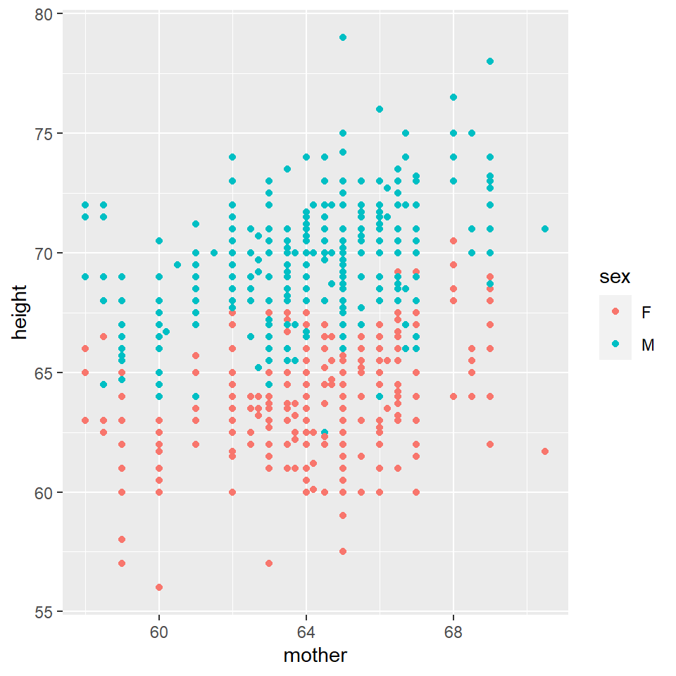
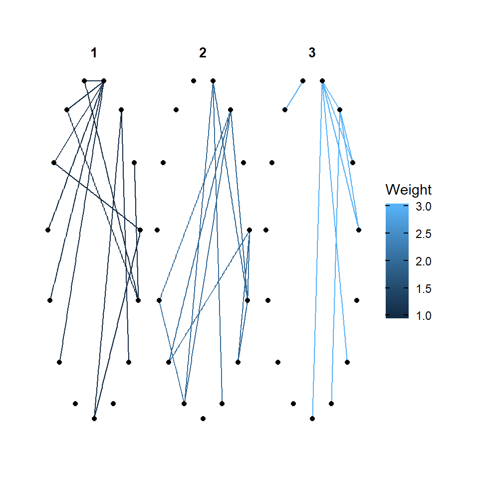

## Introduction

Hi I am Ashwath pursuing foudation studies at Srishti Manipal, and this page has the outcomes of my workshop on R

## Graph 1
### Description
Family - The ID of the family.
Father - The height of the father(inches).
Mother - The height of the mother(inches).
Sex - The gender of the child.
Height - The height of the child.
nkids - The number of adult children in the family.


```
## [1] "family" "father" "mother" "sex"    "height" "nkids"
```

```
## Rows: 898
## Columns: 6
## $ family <fct> 1, 1, 1, 1, 2, 2, 2, 2, 3, 3, 4, 4, 4, 4, 4, 5, 5, 5, 5, 5, 5, ~
## $ father <dbl> 78.5, 78.5, 78.5, 78.5, 75.5, 75.5, 75.5, 75.5, 75.0, 75.0, 75.~
## $ mother <dbl> 67.0, 67.0, 67.0, 67.0, 66.5, 66.5, 66.5, 66.5, 64.0, 64.0, 64.~
## $ sex    <fct> M, F, F, F, M, M, F, F, M, F, M, M, F, F, F, M, M, M, F, F, F, ~
## $ height <dbl> 73.2, 69.2, 69.0, 69.0, 73.5, 72.5, 65.5, 65.5, 71.0, 68.0, 70.~
## $ nkids  <int> 4, 4, 4, 4, 4, 4, 4, 4, 2, 2, 5, 5, 5, 5, 5, 6, 6, 6, 6, 6, 6, ~
```


I am going to plot on a question - Does the daughter's and son's height depend on mother's height? I am going to have my x value as 'mother' and y as 'height'.

## Question - Does the doughter's and son's height depend on mother's height?



The graph shows us whether the children's height is dependent on their mothers. I used geom_point to plot my graph.


## Graph 2 & 3
### Description
In this we were asked to take any data set of our favorite show/ movie/ novel. I chose my favorite show - Sherlock Holmes. In this we were asked to create our own data set and work using that.


```
## # A tibble: 15 x 3
##    Name               Sex   Episodes
##    <chr>              <chr>    <dbl>
##  1 Sherlock Holmes    M           14
##  2 Doctor John Watson M           14
##  3 Mrs. Hudson        F           14
##  4 Jim Moriarty       M            8
##  5 Mycroft Holmes     M            9
##  6 Irene Adler        F            2
##  7 Mary Watson        F            7
##  8 Molly Hooper       F           13
##  9 Inspector Lestrade M           13
## 10 Euros Holmes       F            3
## 11 Anderson           M            6
## 12 Culverton Smith    M            1
## 13 Kity Riley         F            1
## 14 Mr. Holmes         M            2
## 15 Mrs. Holmes        F            2
```

```
## # A tibble: 34 x 4
##     From    To Weight Type        
##    <dbl> <dbl>  <dbl> <chr>       
##  1     1     2      3 Friend      
##  2     1     4      3 Enemy       
##  3     1     5      2 Family      
##  4     1     3      3 Renter      
##  5     1     7      2 Family      
##  6     1     8      3 Professional
##  7     1     6      3 Lovers      
##  8     1     9      2 Professional
##  9     1    10      1 Family      
## 10     1    11      1 Professional
## # ... with 24 more rows
```


I wanted to facet the information according to the relationship they share with each other and the type of bond also that they share with each other.


## faceting according to the type of bond they shared with eachother and the bonding they share between eachother


```
## Warning in grid.Call(C_stringMetric, as.graphicsAnnot(x$label)): font family not
## found in Windows font database
```

```
## Warning in grid.Call(C_textBounds, as.graphicsAnnot(x$label), x$x, x$y, : font
## family not found in Windows font database
```

```
## Warning in grid.Call(C_stringMetric, as.graphicsAnnot(x$label)): font family not
## found in Windows font database

## Warning in grid.Call(C_stringMetric, as.graphicsAnnot(x$label)): font family not
## found in Windows font database
```

```
## Warning in grid.Call.graphics(C_text, as.graphicsAnnot(x$label), x$x, x$y, :
## font family not found in Windows font database
```

```
## Warning in grid.Call(C_textBounds, as.graphicsAnnot(x$label), x$x, x$y, : font
## family not found in Windows font database

## Warning in grid.Call(C_textBounds, as.graphicsAnnot(x$label), x$x, x$y, : font
## family not found in Windows font database
```


```
## Warning in grid.Call(C_textBounds, as.graphicsAnnot(x$label), x$x, x$y, : font
## family not found in Windows font database

## Warning in grid.Call(C_textBounds, as.graphicsAnnot(x$label), x$x, x$y, : font
## family not found in Windows font database

## Warning in grid.Call(C_textBounds, as.graphicsAnnot(x$label), x$x, x$y, : font
## family not found in Windows font database
```

```
## Warning in grid.Call.graphics(C_text, as.graphicsAnnot(x$label), x$x, x$y, :
## font family not found in Windows font database
```

```
## Warning in grid.Call(C_textBounds, as.graphicsAnnot(x$label), x$x, x$y, : font
## family not found in Windows font database

## Warning in grid.Call(C_textBounds, as.graphicsAnnot(x$label), x$x, x$y, : font
## family not found in Windows font database
```




I have used faceting. In this I chose to have one kind of layout, but with two different information. Their are two kind of graphs. 


