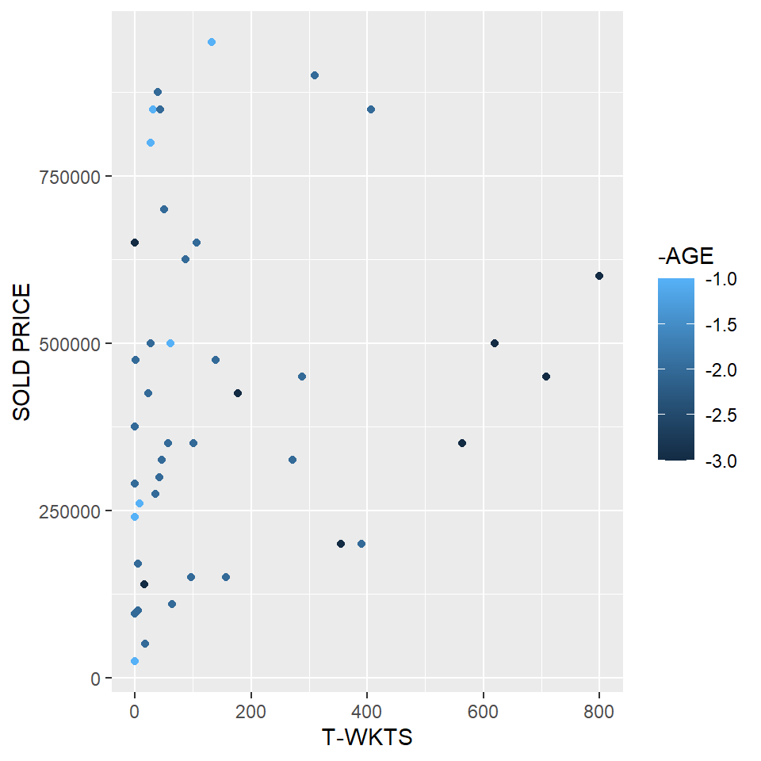
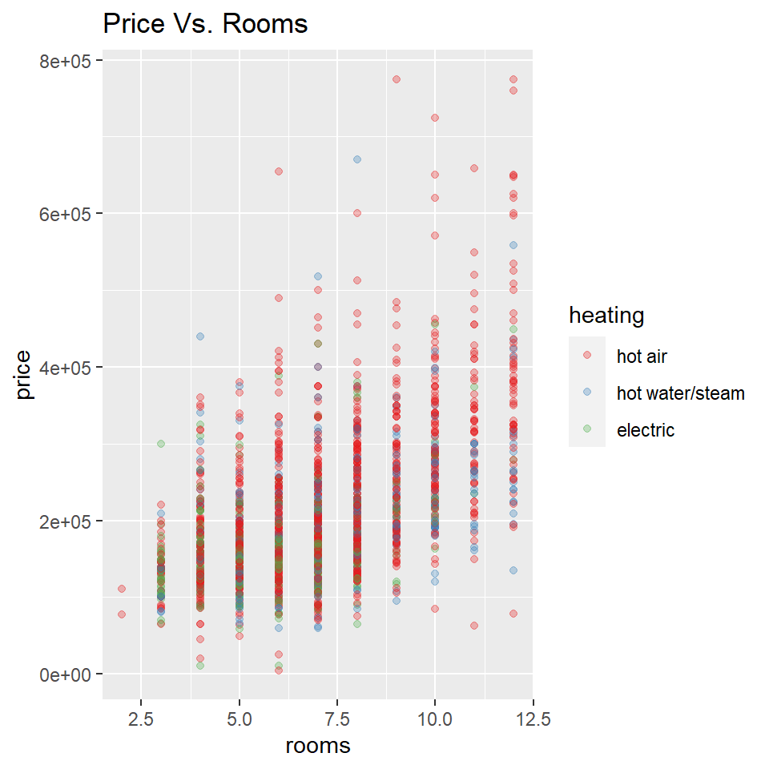
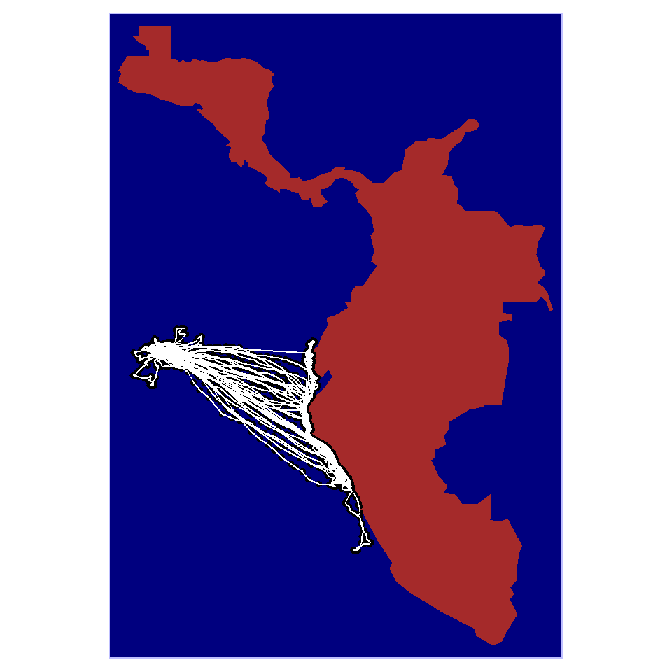

## Introduction

Hi!, I am Eshwar, I am pursuing Human Centered Design at Srishti, on this page you will be seeing the different kinds of data sets I have worked on during my workshop in Srishti, I learnt to use the language R for visualising data and make it more readable for anyone who wants to understand a scenario. There are a few graphs here that will give you some insights about the datasets I worked on.

## Graph 1

The first dataset is about the IPL auction that took place in 2013, here i had access to information such as the player name, their role, their speciality, the price at which they were sold and information about their performance such as the total wickets in their career and total runs.


```
## Rows: 130
## Columns: 26
## $ Sl.NO.          <dbl> 1, 2, 3, 4, 5, 6, 7, 8, 9, 10, 11, 12, 13, 14, 15, 16,~
## $ `PLAYER NAME`   <chr> "Abdulla, YA", "Abdur Razzak", "Agarkar, AB", "Ashwin,~
## $ AGE             <dbl> 2, 2, 2, 1, 2, 2, 2, 2, 2, 2, 2, 3, 1, 2, 2, 2, 2, 2, ~
## $ COUNTRY         <chr> "SA", "BAN", "IND", "IND", "IND", "AUS", "IND", "AUS",~
## $ TEAM            <chr> "KXIP", "RCB", "KKR", "CSK", "CSK", "CSK", "CSK", "CSK~
## $ `Player role`   <chr> "Allrounder", "Bowler", "Bowler", "Bowler", "Batsman",~
## $ `T-RUNS`        <dbl> 0, 214, 571, 284, 63, 0, 51, 54, 83, 5515, 2200, 9918,~
## $ `T-WKTS`        <dbl> 0, 18, 58, 31, 0, 0, 27, 50, 17, 1, 86, 9, 3, 2, 0, 0,~
## $ `ODI-RUNS-S`    <dbl> 0, 657, 1269, 241, 79, 172, 120, 50, 609, 4686, 2004, ~
## $ `ODI-SR-B`      <dbl> 0.00, 71.41, 80.62, 84.56, 45.93, 72.26, 78.94, 92.59,~
## $ `ODI-WKTS`      <dbl> 0, 185, 288, 51, 0, 0, 34, 62, 72, 0, 142, 14, 32, 0, ~
## $ `ODI-SR-BL`     <dbl> 0.0, 37.6, 32.9, 36.8, 0.0, 0.0, 42.5, 31.3, 53.0, 0.0~
## $ `CAPTAINCY EXP` <dbl> 0, 0, 0, 0, 0, 1, 0, 0, 1, 1, 0, 1, 0, 1, 0, 1, 1, 0, ~
## $ `RUNS-S`        <dbl> 0, 0, 167, 58, 1317, 63, 26, 21, 335, 394, 839, 25, 33~
## $ HS              <dbl> 0, 0, 39, 11, 71, 48, 15, 16, 67, 50, 70, 16, 24, 105,~
## $ AVE             <dbl> 0.00, 0.00, 18.56, 5.80, 32.93, 21.00, 4.33, 21.00, 30~
## $ `SR-B`          <dbl> 0.00, 0.00, 121.01, 76.32, 120.71, 95.45, 72.22, 165.8~
## $ SIXERS          <dbl> 0, 0, 5, 0, 28, 0, 1, 1, 3, 13, 38, 0, 9, 42, 36, 64, ~
## $ `RUNS-C`        <dbl> 307, 29, 1059, 1125, 0, 0, 1342, 693, 610, 0, 1338, 0,~
## $ WKTS            <dbl> 15, 0, 29, 49, 0, 0, 52, 37, 19, 0, 47, 0, 73, 0, 4, 0~
## $ `AVE-BL`        <dbl> 20.47, 0.00, 36.52, 22.96, 0.00, 0.00, 25.81, 18.73, 3~
## $ ECON            <dbl> 8.90, 14.50, 8.81, 6.23, 0.00, 0.00, 7.98, 7.22, 6.85,~
## $ `SR-BL`         <dbl> 13.93, 0.00, 24.90, 22.14, 0.00, 0.00, 19.40, 15.57, 2~
## $ `AUCTION YEAR`  <dbl> 2009, 2008, 2008, 2011, 2011, 2009, 2011, 2011, 2011, ~
## $ `BASE PRICE`    <dbl> 50000, 50000, 200000, 100000, 100000, 50000, 100000, 2~
## $ `SOLD PRICE`    <dbl> 50000, 50000, 350000, 850000, 800000, 50000, 500000, 7~
```

The one thing i wanted to analyse was how the performance of the player impacts the sold price and I plotted a point graph to undertsand this by taking the batsmen that participated and plotting their performance on the X axis and their sold price on the Y axis.




The results of this plot were quite surprising to me as i was able to see that there are players who are really young in the game and really few performance indicators that have been sold for a very high price compared the players who have the best performance and most experience, but i realized that this could also be because of IPL being an emerging series and teams might have just wanted to take in potential good players and train them. The graded colors are used to indicate the experience of the players.

## Graph 2

For the next graph I chose a dataset that had the information about the listed houses in the Saratoga county of California, the data has information about the number of rooms in the houses, the type of air conditioning, price of the property, size of the property and other relevant information. I wanted to check how the price of properties range based on the number of rooms they have and the type of heating systems they have.


```
## Rows: 1,728
## Columns: 16
## $ price           <int> 132500, 181115, 109000, 155000, 86060, 120000, 153000,~
## $ lotSize         <dbl> 0.09, 0.92, 0.19, 0.41, 0.11, 0.68, 0.40, 1.21, 0.83, ~
## $ age             <int> 42, 0, 133, 13, 0, 31, 33, 23, 36, 4, 123, 1, 13, 153,~
## $ landValue       <int> 50000, 22300, 7300, 18700, 15000, 14000, 23300, 14600,~
## $ livingArea      <int> 906, 1953, 1944, 1944, 840, 1152, 2752, 1662, 1632, 14~
## $ pctCollege      <int> 35, 51, 51, 51, 51, 22, 51, 35, 51, 44, 51, 51, 41, 57~
## $ bedrooms        <int> 2, 3, 4, 3, 2, 4, 4, 4, 3, 3, 7, 3, 2, 3, 3, 3, 3, 4, ~
## $ fireplaces      <int> 1, 0, 1, 1, 0, 1, 1, 1, 0, 0, 0, 0, 0, 0, 0, 0, 0, 1, ~
## $ bathrooms       <dbl> 1.0, 2.5, 1.0, 1.5, 1.0, 1.0, 1.5, 1.5, 1.5, 1.5, 1.0,~
## $ rooms           <int> 5, 6, 8, 5, 3, 8, 8, 9, 8, 6, 12, 6, 4, 5, 8, 4, 7, 12~
## $ heating         <fct> electric, hot water/steam, hot water/steam, hot air, h~
## $ fuel            <fct> electric, gas, gas, gas, gas, gas, oil, oil, electric,~
## $ sewer           <fct> septic, septic, public/commercial, septic, public/comm~
## $ waterfront      <fct> No, No, No, No, No, No, No, No, No, No, No, No, No, No~
## $ newConstruction <fct> No, No, No, No, Yes, No, No, No, No, No, No, No, No, N~
## $ centralAir      <fct> No, No, No, No, Yes, No, No, No, No, No, No, No, No, N~
```

The graph I used to plot this information is a point graph with the rooms on the X axis and the prices on the Y axis, the points are coloured on the basis of what kind of heating they have. houses with electric heating system seem to be going for a very low price here and alternatively we might also understand that electric heating system probably only works best for houses with less rooms and that might be why we dont see any high priced houses with electric heating.



## Graph 4

We learnt to plot maps using R in our workshop and I wanted to plot the migration tracks of the Galapagos Albatross, using packages such as tmap and data from movebank i plotted this information.


```
## Reading layer `points' from data source 
##   `C:\Users\Arvind\My Drive\R work\MyWebsites\dtt-2021-2022\content\portfolio\Eshwar Venkatesan\points.shp' 
##   using driver `ESRI Shapefile'
## Simple feature collection with 16028 features and 0 fields
## Geometry type: POINT
## Dimension:     XY
## Bounding box:  xmin: -91.3732 ymin: -12.79464 xmax: -77.51874 ymax: 0.1821983
## CRS:           NA
```

```
## Reading layer `lines' from data source 
##   `C:\Users\Arvind\My Drive\R work\MyWebsites\dtt-2021-2022\content\portfolio\Eshwar Venkatesan\lines.shp' 
##   using driver `ESRI Shapefile'
## Simple feature collection with 56 features and 0 fields (with 28 geometries empty)
## Geometry type: LINESTRING
## Dimension:     XY
## Bounding box:  xmin: -91.3732 ymin: -12.79464 xmax: -77.51874 ymax: 0.1821983
## CRS:           NA
```


```
## Warning: Currect projection of shape animalpoints unknown. Long-lat (WGS84) is
## assumed.
```

```
## Warning: Currect projection of shape animallines unknown. Long-lat (WGS84) is
## assumed.
```

```
## Warning: The shape animallines contains empty units.
```



## Graph 5

We made networks to analyse the connections between various people involved in an environment and we tried to plot the network of connections between the characters of the show Brooklyn 99, with the help of my team mate Siddanth, I created a dataset about the characters and the interactions they have, we plotted this information and displayed the most connected person in the show.


```{=html}
<div id="htmlwidget-fb38566508a27cb9a35f" style="width:480px;height:480px;" class="visNetwork html-widget"></div>
<script type="application/json" data-for="htmlwidget-fb38566508a27cb9a35f">{"x":{"nodes":{"id":[1,2,3,4,5,6,7,8,9,10,11,12,13,14,15,16,17,18,19,20],"label":["Jake Peralta","Rosa Diaz","Terry Jeffords","Amy Santiago","Charles Boyle","Gina Linetti","Raymond Holt","Michael Hitchcock","Norm Scully","Milepnos","Doug Judy","Vulture","Sharron Jeffords","Kevin Cozner","Bob Anderrson","Trudy Judy","Nikolaj Boyle","Adrian Pimento","Maura Figgis","Steve Boyle"],"ID":[1,2,3,4,5,6,7,8,9,10,11,12,13,14,15,16,17,18,19,20],"group":["Male","Female","Male","Female","Male","Female","Male","Male","Male","Male","Male","Male","Female","Male","Male","Female","Male","Male","Female","Male"],"role":["Detective","Detective","Sargeant","Detective","Detective","Personal Assistant","Captain","Detective","Detective","Citizen","Criminal","Captain","Family","Family","FBI Agent","Criminal","Family","Detective","Criminal","Family"],"pers.trait":["immature","violent","protective","competitive","eccentric","narcissistic","serious","lazy","lazy","confused","immature","obnoxious","kind","serious","serious","cunning","kind","violent","violent","attention seeking"],"obsessions":["Die Hard","Swords","Yogurt","Binders","food","herself","discipline","food","food","dance","Die Hard","power","kids","discipline","discipline","boys","police toys","self harm","Charles Boyle","cousins"]},"edges":{"from":[1,1,1,1,1,1,1,1,1,1,1,1,1,1,1,1,1,2,2,2,2,2,2,2,2,2,2,2,3,3,3,3,3,3,3,3,3,3,4,4,4,4,4,4,4,4,4,4,4,4,6,6,6,6,6,6,6,6,5,5,5,5,5,5,5,5,5,5,5,7,7,7,7,7,7,7,7,8,8,8,9,9,11,2],"to":[4,5,6,7,8,9,10,11,12,13,14,15,16,17,18,2,3,3,4,5,6,7,8,9,14,15,18,11,12,4,5,6,7,8,9,13,15,18,18,12,5,6,7,8,9,10,11,14,15,19,5,7,8,9,12,13,14,18,14,12,7,8,9,15,13,17,18,19,20,8,9,11,12,13,14,15,18,9,18,12,18,12,16,12]},"nodesToDataframe":true,"edgesToDataframe":true,"options":{"width":"100%","height":"100%","nodes":{"shape":"dot","font":{"size":20}},"manipulation":{"enabled":false},"layout":{"randomSeed":12345},"edges":{"title":{"from":[1,1,1,1,1,1,1,1,1,1,1,1,1,1,1,1,1,2,2,2,2,2,2,2,2,2,2,2,3,3,3,3,3,3,3,3,3,3,4,4,4,4,4,4,4,4,4,4,4,4,6,6,6,6,6,6,6,6,5,5,5,5,5,5,5,5,5,5,5,7,7,7,7,7,7,7,7,8,8,8,9,9,11,2],"to":[4,5,6,7,8,9,10,11,12,13,14,15,16,17,18,2,3,3,4,5,6,7,8,9,14,15,18,11,12,4,5,6,7,8,9,13,15,18,18,12,5,6,7,8,9,10,11,14,15,19,5,7,8,9,12,13,14,18,14,12,7,8,9,15,13,17,18,19,20,8,9,11,12,13,14,15,18,9,18,12,18,12,16,12]}},"groups":{"Female":{"shape":"icon","icon":{"face":"Ionicons","code":"f25d","color":"lightpink","size":125}},"useDefaultGroups":true,"Male":{"shape":"icon","icon":{"face":"Ionicons","code":"f202","color":"lightblue","size":125}}},"interaction":{"hover":true,"hoverConnectedEdges":true,"navigationButtons":true,"selectConnectedEdges":true,"zoomView":true,"zoomSpeed":1}},"groups":["Male","Female"],"width":null,"height":null,"idselection":{"enabled":false},"byselection":{"enabled":false},"main":null,"submain":null,"footer":null,"background":"rgba(0, 0, 0, 0)","legend":{"width":0.2,"useGroups":true,"position":"left","ncol":1,"stepX":100,"stepY":100,"zoom":true},"iconsRedraw":true,"tooltipStay":300,"tooltipStyle":"position: fixed;visibility:hidden;padding: 5px;white-space: nowrap;font-family: verdana;font-size:14px;font-color:#000000;background-color: #f5f4ed;-moz-border-radius: 3px;-webkit-border-radius: 3px;border-radius: 3px;border: 1px solid #808074;box-shadow: 3px 3px 10px rgba(0, 0, 0, 0.2);"},"evals":[],"jsHooks":[]}</script>
```


## My Course Reflection

I was really excited for this course because this was the first Digital Thinking course i was alloted to and i was eagerly looking forward to what we would be learning, and when i got to know about the fact that we will be learning R, I was really excited and since then this class has been all about coding in R, plotting graohs, maps, networks and understanding the logic behind various algorithms, atleast on the surface, deep down we were always asked to look at numbers and understand their impact on the daily lives of people, animals, our environment and beyond. 

I learnt to make sure I don't jump into conclusions about any scenario without doing my due diligence on it. I learnt to code in R surely a flex, understood the importance of bringing context into light when analysing any form of data. Learnt about many 80s references and proverbs that just make life better. Understanding the importance of data and how to handle sensitive data and represent it in a way that will spark conversation and yet not cause controversy. Understanding to develop personal connections with the work I did to gain a deeper understanding of any concept. 

As an aspiring Human Centered Designer, I have been told that it is very important to understand our users and research them before designing for them, this means we probably will have to deal with a lots and lots of data that might get very hard to read as a bunch of specs on a spreadsheet and i am pretty sure with the powerful and robust setup of R I will be able to develop visuals and outcomes that will help me or my organisation to make informed decisions about the work we need to do. I also think the contextual learnings i received from this course will benefit me hugely throughout my life.

"Arvind is a horrible teacher and simply does not get what we need.Boomers shouldnt be allowed to teach any more in Srishti." is what Arvind thinks we want to say but if other boomers are even 1/10th of what Arvind is then we clearly dont have enough boomers in Srishti, I would like to thank Arvind and the entire class for such a great experience i really had a lots of fun and many R puns for sure.

Thank You!!

Jai Hind.
