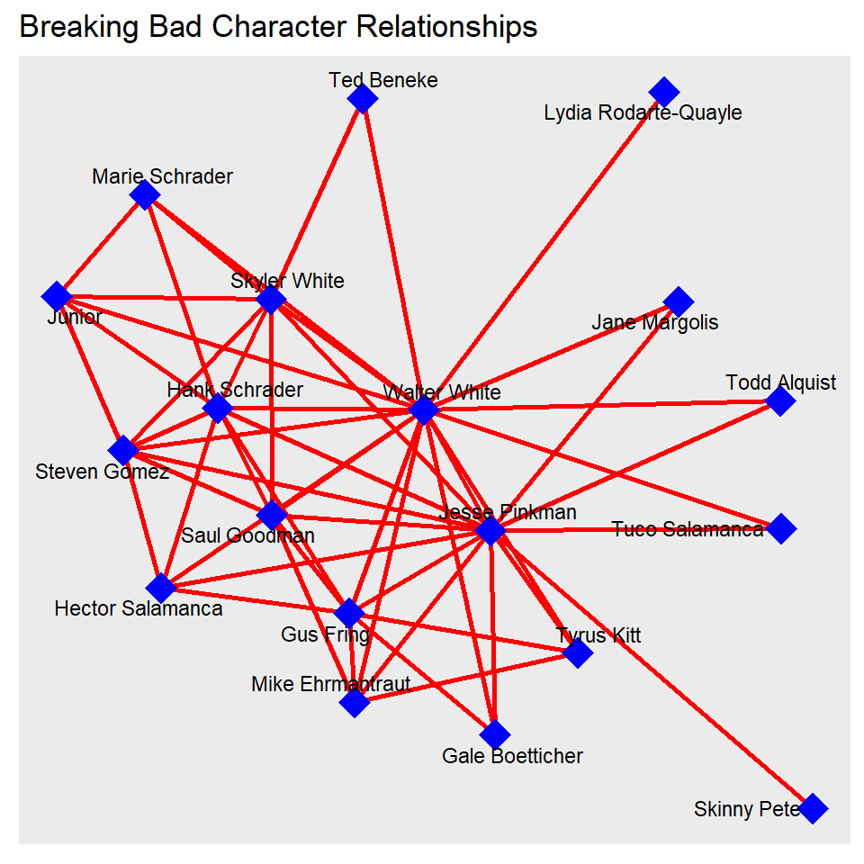
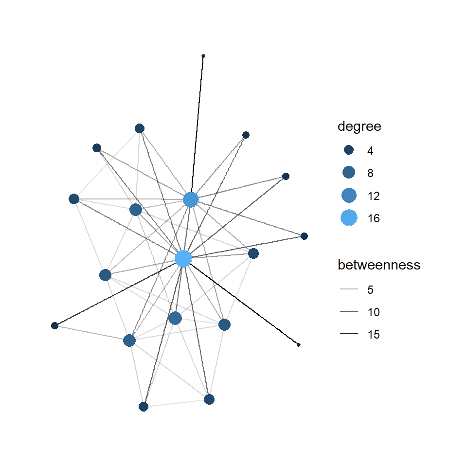
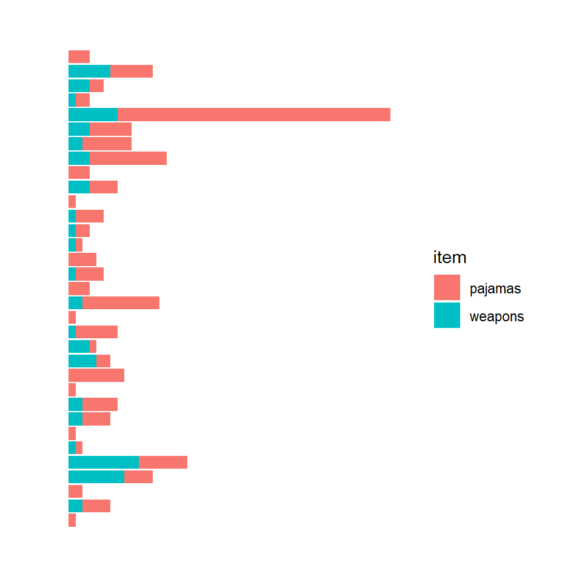

## Introduction

Hi I am Hemant pursuing foudation studies at Srishti Manipal, and this page has the outcomes of my workshop on R.

## Graph 1 & 2
### Description
I decided to work on creating a Breaking Bad dataset for this project. The show contains good amount of characters to play around with.
The show belongs to a unique genre, where they deal with the narcotics industry in the Southern USA. 

It took us some time to decide the headings of the columns in the nodes and edges dataset because it is not every other show. Since death played a big role in the show, we tried including the kill count of each character and also their involvement in drugs.


```
##  [1] "Walter White "        "Jesse Pinkman "       "Gus Fring "          
##  [4] "Hank Schrader "       "Skyler White "        "Mike Ehrmantraut "   
##  [7] "Saul Goodman "        "Junior "              "Gale Boetticher "    
## [10] "Ted Beneke"           "Marie Schrader "      "Tuco Salamanca "     
## [13] "Skinny Pete"          "Jane Margolis "       "Tyrus Kitt"          
## [16] "Steven Gomez"         "Lydia Rodarte-Quayle" "Todd Alquist "       
## [19] "Hector Salamanca "
```

```
## Warning: Unknown or uninitialised column: `From`.
```

```
## NULL
```

```
## Warning: Unknown or uninitialised column: `To`.
```

```
## NULL
```

```
## Warning: Unknown or uninitialised column: `From`.
```

```
## Warning: Unknown or uninitialised column: `To`.
```

```
## NULL
```

```
## # A tbl_graph: 19 nodes and 53 edges
## #
## # An undirected simple graph with 1 component
## #
## # Node Data: 19 x 7 (active)
##   Character_Name Sex   Alive_or_Dead Jobs  `Murders_Death~` No_of_Episodes
##   <chr>          <chr> <chr>         <chr>            <dbl>          <dbl>
## 1 "Walter White~ M     Dead          "Che~              201             62
## 2 "Jesse Pinkma~ M     Alive         "Une~                8             62
## 3 "Gus Fring "   M     Dead          "Bus~               27             24
## 4 "Hank Schrade~ M     Dead          "Pol~                2             51
## 5 "Skyler White~ F     Alive         "Cor~                0             61
## 6 "Mike Ehrmant~ M     Dead          "Hit~                9             25
## # ... with 13 more rows, and 1 more variable: Groups <chr>
## #
## # Edge Data: 53 x 5
##    from    to `Relationship_Weightage ` `Relationship_Type ` ...5 
##   <int> <int>                     <dbl> <chr>                <lgl>
## 1     1     2                        10 Friends              NA   
## 2     1     3                         5 Proffesional         NA   
## 3     1     4                         8 Family               NA   
## # ... with 50 more rows
```


A simple representation of the network of the Breaking Bad character. The nodes in the centre must represent the character of Jesse Pinkman and Walter White.




```
## Warning in grid.Call(C_stringMetric, as.graphicsAnnot(x$label)): font family not
## found in Windows font database

## Warning in grid.Call(C_stringMetric, as.graphicsAnnot(x$label)): font family not
## found in Windows font database
```

```
## Warning in grid.Call(C_textBounds, as.graphicsAnnot(x$label), x$x, x$y, : font
## family not found in Windows font database

## Warning in grid.Call(C_textBounds, as.graphicsAnnot(x$label), x$x, x$y, : font
## family not found in Windows font database

## Warning in grid.Call(C_textBounds, as.graphicsAnnot(x$label), x$x, x$y, : font
## family not found in Windows font database

## Warning in grid.Call(C_textBounds, as.graphicsAnnot(x$label), x$x, x$y, : font
## family not found in Windows font database

## Warning in grid.Call(C_textBounds, as.graphicsAnnot(x$label), x$x, x$y, : font
## family not found in Windows font database

## Warning in grid.Call(C_textBounds, as.graphicsAnnot(x$label), x$x, x$y, : font
## family not found in Windows font database
```



## Graph 3
### Description
Banned items dataset is a collection of items banned in US schools and consits of *schoolName*, *state*, *item*, *type* and *prohibited* column that specifies the gender.


```
## Rows: 15,144
## Columns: 5
## $ schoolName <chr> "RUSK H S", "RUSK H S", "EAST HIGH", "TOMAHAWK HIGH", "TOMA~
## $ state      <chr> "TX", "TX", "UT", "WI", "WI", "WI", "WI", "WI", "OK", "TX",~
## $ item       <chr> "pillows", "stuffed animals", "dangling belts", "wallet cha~
## $ type       <chr> "accessories", "accessories", "accessories", "accessories",~
## $ prohibited <chr> "none", "none", "none", "none", "none", "none", "none", "no~
```

I want to plot a graph to compare two item type based on their frequency in the banned item list. The two items are **pajamas** and **weapons**


```
## Warning in grid.Call(C_textBounds, as.graphicsAnnot(x$label), x$x, x$y, : font
## family not found in Windows font database

## Warning in grid.Call(C_textBounds, as.graphicsAnnot(x$label), x$x, x$y, : font
## family not found in Windows font database

## Warning in grid.Call(C_textBounds, as.graphicsAnnot(x$label), x$x, x$y, : font
## family not found in Windows font database

## Warning in grid.Call(C_textBounds, as.graphicsAnnot(x$label), x$x, x$y, : font
## family not found in Windows font database
```




