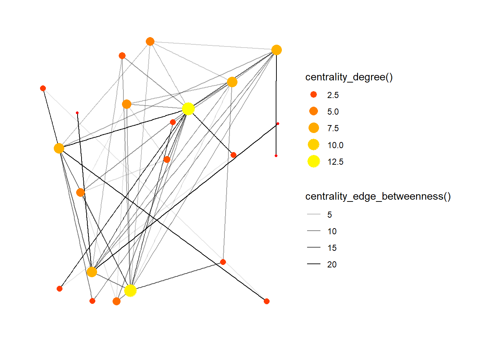

## Introduction

This workshop taught me something that I would never opt to do on my own. Learning R gave me a new tool to imagine and create new designs. Analyzing and reading data can give so many creative outcomes.  

## Graph 1

**This data is about the adoption of Dogs in the US.  The different criteria on which the dogs are adopted is described in this data. The different varieties of breeds and color makes this data interesting.**


```
## # A tibble: 58,180 x 6
##    breed_primary                  color_primary  age   sex   size  contact_state
##    <chr>                          <chr>          <chr> <chr> <chr> <chr>        
##  1 American Staffordshire Terrier White / Cream  Seni~ Male  Medi~ NV           
##  2 Pit Bull Terrier               Brown / Choco~ Adult Male  Large NV           
##  3 Shepherd                       Brindle        Adult Male  Large NV           
##  4 German Shepherd Dog            <NA>           Baby  Fema~ Large NV           
##  5 Dachshund                      <NA>           Young Male  Small NV           
##  6 Boxer                          <NA>           Baby  Male  Medi~ NV           
##  7 Italian Greyhound              <NA>           Baby  Fema~ Small NV           
##  8 Cattle Dog                     <NA>           Baby  Male  Medi~ NV           
##  9 Cattle Dog                     <NA>           Baby  Fema~ Medi~ NV           
## 10 Cattle Dog                     <NA>           Baby  Male  Medi~ NV           
## # ... with 58,170 more rows
```

```
## Rows: 58,180
## Columns: 6
## $ breed_primary <chr> "American Staffordshire Terrier", "Pit Bull Terrier", "S~
## $ color_primary <chr> "White / Cream", "Brown / Chocolate", "Brindle", NA, NA,~
## $ age           <chr> "Senior", "Adult", "Adult", "Baby", "Young", "Baby", "Ba~
## $ sex           <chr> "Male", "Male", "Male", "Female", "Male", "Male", "Femal~
## $ size          <chr> "Medium", "Large", "Large", "Large", "Small", "Medium", ~
## $ contact_state <chr> "NV", "NV", "NV", "NV", "NV", "NV", "NV", "NV", "NV", "N~
```

**This graph describes the top 10 breeds which are adopted.**


**In this graph the tools like reorder, arrange, group by and filter are used.  Trying out the function of scale filler brewer and selecting an appropriate color palette makes this graph more interesting and easy to read too.**

## Graph 2

**This data set is based on the TV show 'Friends' , the information collected is based on the conversation and interaction between each person in the chosen episodes.**


```
## # A tibble: 22 x 7
##    Numbers Name             Sex   Profession     `Animal Lover` `Relationship ~`
##      <dbl> <chr>            <chr> <chr>          <chr>          <chr>           
##  1       1 "Chandler Bing " M     "statistical ~ No             Dating          
##  2       2 "Phoebe Buffay"  F     "Self - taugh~ Yes            Dating          
##  3       3 "Rachel Green"   F     "Waitress"     Yes            Dating          
##  4       4 "Ross Geller"    M     "Paleantologi~ Yes            Divorced        
##  5       5 "Monica Geller"  F     "Chef"         Yes            Dating          
##  6       6 "Joey Tribbiani" M     "Actor"        Yes            Single          
##  7       7 "Paolo"          M     "Actor"        Yes            Dating          
##  8       8 "Jill Goodacre"  F     "Model"        <NA>           Single          
##  9       9 "Mr. Heckles"    M     "Retired"      No             Widower         
## 10      10 "Jack Geller "   M     "Lawyer"       Yes            Married         
## # ... with 12 more rows, and 1 more variable: `Character Trait` <chr>
```

```
## # A tibble: 50 x 4
##    `from `    to Weight Type      
##      <dbl> <dbl>  <dbl> <chr>     
##  1       2     5     12 Friends   
##  2       1     8      1 Inftuation
##  3       5     1     10 Friends   
##  4       6     1     11 Roommates 
##  5       5     6      9 Friends   
##  6       4     2     12 Friends   
##  7       3     4     14 Inftuation
##  8       4     6     13 Friends   
##  9       3     9      1 Neighbours
## 10       2     9      1 Neighbours
## # ... with 40 more rows
```

```
## # A tbl_graph: 22 nodes and 50 edges
## #
## # An undirected simple graph with 1 component
## #
## # Node Data: 22 x 7 (active)
##   Numbers Name  Sex   Profession `Animal Lover` `Relationship ~`
##     <dbl> <chr> <chr> <chr>      <chr>          <chr>           
## 1       1 "Cha~ M     "statisti~ No             Dating          
## 2       2 "Pho~ F     "Self - t~ Yes            Dating          
## 3       3 "Rac~ F     "Waitress" Yes            Dating          
## 4       4 "Ros~ M     "Paleanto~ Yes            Divorced        
## 5       5 "Mon~ F     "Chef"     Yes            Dating          
## 6       6 "Joe~ M     "Actor"    Yes            Single          
## # ... with 16 more rows, and 1 more variable: `Character Trait` <chr>
## #
## # Edge Data: 50 x 4
##    from    to Weight Type      
##   <int> <int>  <dbl> <chr>     
## 1     2     5     12 Friends   
## 2     1     8      1 Inftuation
## 3     1     5     10 Friends   
## # ... with 47 more rows
```

**Network map.  This is a linear network of communication that shows the frequency of the conversations between each other and the kind of relationships they have among themselves.  The thickness of the lines depicts the strength of their relationship.  The thicker the line, frequent the communication.  Hence, stronger bond.**


## Graph 3

**The data set includes the conversations and communications between the characters of the TV show 'Friends'.**


```
## # A tbl_graph: 22 nodes and 50 edges
## #
## # An undirected simple graph with 1 component
## #
## # Edge Data: 50 x 5 (active)
##    from    to Weight Type       betweenness
##   <int> <int>  <dbl> <chr>            <dbl>
## 1     2     5     12 Friends          17.1 
## 2     1     8      1 Inftuation       21   
## 3     1     5     10 Friends          10.6 
## 4     1     6     11 Roommates         8.53
## 5     5     6      9 Friends           2.6 
## 6     2     4     12 Friends          21.0 
## # ... with 44 more rows
## #
## # Node Data: 22 x 8
##   Numbers Name  Sex   Profession `Animal Lover` `Relationship ~`
##     <dbl> <chr> <chr> <chr>      <chr>          <chr>           
## 1       1 "Cha~ M     "statisti~ No             Dating          
## 2       2 "Pho~ F     "Self - t~ Yes            Dating          
## 3       3 "Rac~ F     "Waitress" Yes            Dating          
## # ... with 19 more rows, and 2 more variables: `Character Trait` <chr>,
## #   degree <dbl>
```

**The number of conversations each character has with another affects the intensity of the dots and the lines.  The bigger the points, the greater the connections. This explains the degree of the data.  The difference in the thickness of lines shows how many times a conversation has passed through another conversation between a third party.**



## My Course Reflection

This course was all about collecting data , analyzing the data and learning how to represent in a creative visualization.  This class gave me a new direction to present my thoughts.  As this class was taught by the best Arvind , I enjoyed these two weeks of learning R too much.  I am sure R will help me in my later years. 


