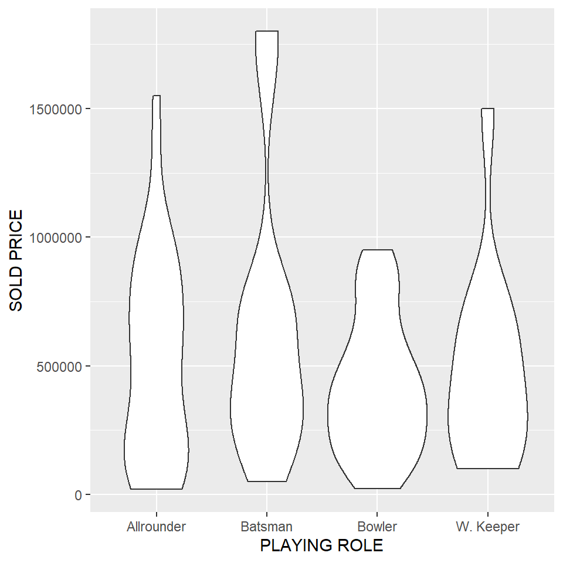
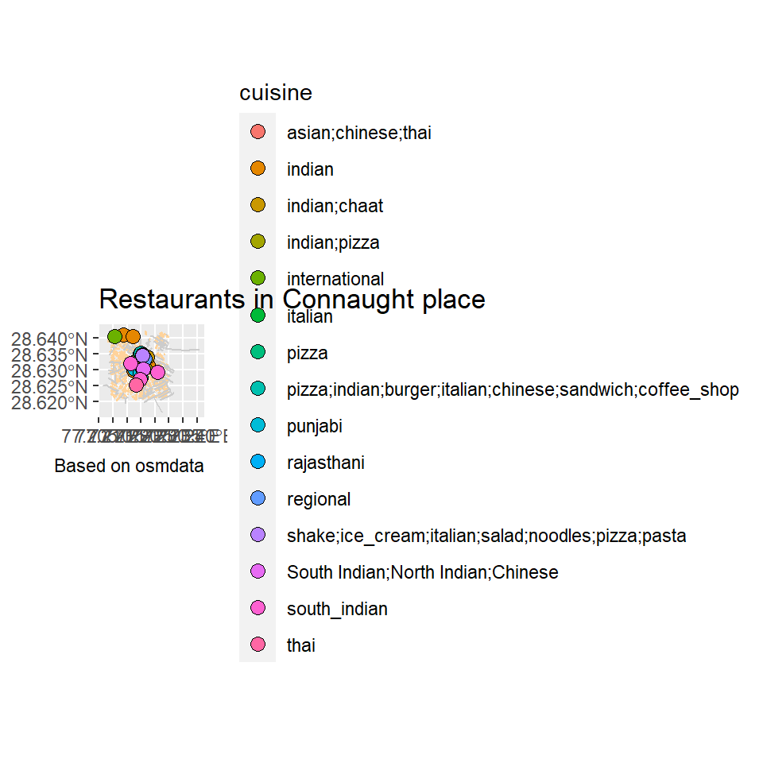
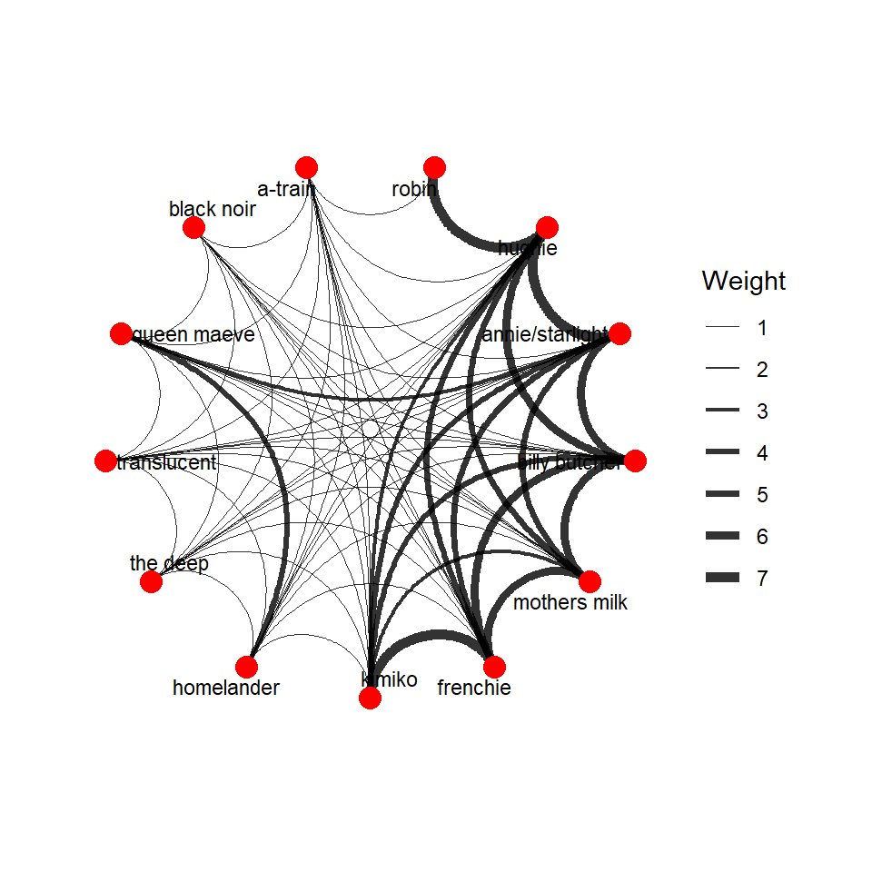

## Introduction

I am Mohit Dasgupta. Here are some of my best works in Data Visualization in R, which I executed in the Digital Thinking Tools Workshop during Feb 2022. 

## Graph 1

Brief introduction of your chosen data set Describe the interesting columns and what they mean

This Dataset is about the IPL auction that happened in the year 2013, It shows the sold price and the base price of different players and which teams they went to.


```
## Rows: 130
## Columns: 26
## $ Sl.NO.          <dbl> 1, 2, 3, 4, 5, 6, 7, 8, 9, 10, 11, 12, 13, 14, 15, 16,~
## $ `PLAYER NAME`   <chr> "Abdulla, YA", "Abdur Razzak", "Agarkar, AB", "Ashwin,~
## $ AGE             <dbl> 2, 2, 2, 1, 2, 2, 2, 2, 2, 2, 2, 3, 1, 2, 2, 2, 2, 2, ~
## $ COUNTRY         <chr> "SA", "BAN", "IND", "IND", "IND", "AUS", "IND", "AUS",~
## $ TEAM            <chr> "KXIP", "RCB", "KKR", "CSK", "CSK", "CSK", "CSK+", "CS~
## $ `PLAYING ROLE`  <chr> "Allrounder", "Bowler", "Bowler", "Bowler", "Batsman",~
## $ `T-RUNS`        <dbl> 0, 214, 571, 284, 63, 0, 51, 54, 83, 5515, 2200, 9918,~
## $ `T-WKTS`        <dbl> 0, 18, 58, 31, 0, 0, 27, 50, 17, 1, 86, 9, 3, 2, 0, 0,~
## $ `ODI-RUNS-S`    <dbl> 0, 657, 1269, 241, 79, 172, 120, 50, 609, 4686, 2004, ~
## $ `ODI-SR-B`      <dbl> 0.00, 71.41, 80.62, 84.56, 45.93, 72.26, 78.94, 92.59,~
## $ `ODI-WKTS`      <dbl> 0, 185, 288, 51, 0, 0, 34, 62, 72, 0, 142, 14, 32, 0, ~
## $ `ODI-SR-BL`     <dbl> 0.0, 37.6, 32.9, 36.8, 0.0, 0.0, 42.5, 31.3, 53.0, 0.0~
## $ `CAPTAINCY EXP` <dbl> 0, 0, 0, 0, 0, 1, 0, 0, 1, 1, 0, 1, 0, 1, 0, 1, 1, 0, ~
## $ `RUNS-S`        <dbl> 0, 0, 167, 58, 1317, 63, 26, 21, 335, 394, 839, 25, 33~
## $ HS              <dbl> 0, 0, 39, 11, 71, 48, 15, 16, 67, 50, 70, 16, 24, 105,~
## $ AVE             <dbl> 0.00, 0.00, 18.56, 5.80, 32.93, 21.00, 4.33, 21.00, 30~
## $ `SR-B`          <dbl> 0.00, 0.00, 121.01, 76.32, 120.71, 95.45, 72.22, 165.8~
## $ SIXERS          <dbl> 0, 0, 5, 0, 28, 0, 1, 1, 3, 13, 38, 0, 9, 42, 36, 64, ~
## $ `RUNS-C`        <dbl> 307, 29, 1059, 1125, 0, 0, 1342, 693, 610, 0, 1338, 0,~
## $ WKTS            <dbl> 15, 0, 29, 49, 0, 0, 52, 37, 19, 0, 47, 0, 73, 0, 4, 0~
## $ `AVE-BL`        <dbl> 20.47, 0.00, 36.52, 22.96, 0.00, 0.00, 25.81, 18.73, 3~
## $ ECON            <dbl> 8.90, 14.50, 8.81, 6.23, 0.00, 0.00, 7.98, 7.22, 6.85,~
## $ `SR-BL`         <dbl> 13.93, 0.00, 24.90, 22.14, 0.00, 0.00, 19.40, 15.57, 2~
## $ `AUCTION YEAR`  <dbl> 2009, 2008, 2008, 2011, 2011, 2009, 2011, 2011, 2011, ~
## $ `BASE PRICE`    <dbl> 50000, 50000, 200000, 100000, 100000, 50000, 100000, 2~
## $ `SOLD PRICE`    <dbl> 50000, 50000, 350000, 850000, 800000, 50000, 500000, 7~
```

Describe briefly what graph you are going to plot

It is a graph about the different playing roles of players in the IPL auction of 2013 and what was their sold price.



Brief concluding remarks. What does the graph show? What geometric aesthetics did you use, for example?

The graph shows the different amount of playing roles and which one has the most players in a particular price bracket and which role has the longest range. I used the violin graph which utilizes area and length to depict values that a bar graph cannot.
## Graph 2

Brief introduction of your chosen data set Describe the interesting
columns and what they mean


```
## Reading layer `buildings' from data source 
##   `C:\Users\Arvind\My Drive\R work\MyWebsites\dtt-2021-2022\content\portfolio\Mohit Dasgupta\buildings.gpkg' 
##   using driver `GPKG'
## Simple feature collection with 988 features and 49 fields
## Geometry type: POLYGON
## Dimension:     XY
## Bounding box:  xmin: 77.20806 ymin: 28.62026 xmax: 77.23001 ymax: 28.64241
## Geodetic CRS:  WGS 84
```

```
## Reading layer `parks' from data source 
##   `C:\Users\Arvind\My Drive\R work\MyWebsites\dtt-2021-2022\content\portfolio\Mohit Dasgupta\parks.gpkg' 
##   using driver `GPKG'
## Simple feature collection with 9 features and 10 fields
## Geometry type: POLYGON
## Dimension:     XY
## Bounding box:  xmin: 77.21095 ymin: 28.62314 xmax: 77.23084 ymax: 28.63825
## Geodetic CRS:  WGS 84
```

```
## Reading layer `greenery' from data source 
##   `C:\Users\Arvind\My Drive\R work\MyWebsites\dtt-2021-2022\content\portfolio\Mohit Dasgupta\greenery.gpkg' 
##   using driver `GPKG'
## Simple feature collection with 2 features and 2 fields
## Geometry type: POLYGON
## Dimension:     XY
## Bounding box:  xmin: 77.21559 ymin: 28.62145 xmax: 77.22953 ymax: 28.62823
## Geodetic CRS:  WGS 84
```

```
## Reading layer `trees' from data source 
##   `C:\Users\Arvind\My Drive\R work\MyWebsites\dtt-2021-2022\content\portfolio\Mohit Dasgupta\trees.gpkg' 
##   using driver `GPKG'
## Simple feature collection with 2 features and 2 fields
## Geometry type: POINT
## Dimension:     XY
## Bounding box:  xmin: 77.21924 ymin: 28.62756 xmax: 77.21936 ymax: 28.62953
## Geodetic CRS:  WGS 84
```

```
## Reading layer `roads' from data source 
##   `C:\Users\Arvind\My Drive\R work\MyWebsites\dtt-2021-2022\content\portfolio\Mohit Dasgupta\roads.gpkg' 
##   using driver `GPKG'
## Simple feature collection with 148 features and 12 fields
## Geometry type: LINESTRING
## Dimension:     XY
## Bounding box:  xmin: 77.20666 ymin: 28.61656 xmax: 77.24091 ymax: 28.64293
## Geodetic CRS:  WGS 84
```

```
## Reading layer `restaurants' from data source 
##   `C:\Users\Arvind\My Drive\R work\MyWebsites\dtt-2021-2022\content\portfolio\Mohit Dasgupta\restaurants.gpkg' 
##   using driver `GPKG'
## Simple feature collection with 86 features and 57 fields
## Geometry type: POINT
## Dimension:     XY
## Bounding box:  xmin: 77.21031 ymin: 28.62491 xmax: 77.22603 ymax: 28.64121
## Geodetic CRS:  WGS 84
```


Describe briefly what graph you are going to plot

The graph that I am going to plot shows the number of restaurants and the different kinds of cuisines they have to offer.




## Graph 3

Brief introduction of your chosen data set Describe the interesting
columns and what they mean


We made a data set based upon the t.v. series "The Boys" and we wanted to show how the relationship of the characted had evolved or even were something that was should not have been the same way but circumstances played a beautiful role in shaping the story

```
## # A tibble: 13 x 9
##       id gender relation species life  race     group     `kill count` name     
##    <dbl> <chr>  <chr>    <chr>   <chr> <chr>    <chr>            <dbl> <chr>    
##  1     1 female taken    human   dead  biracial <NA>                 0 robin    
##  2     2 male   single   human   alive white    the boys             2 hughie   
##  3     3 female taken    supe    alive white    the seven            1 annie/st~
##  4     4 male   taken    human   alive white    the boys             7 billy bu~
##  5     5 male   taken    human   alive black    the boys             0 mothers ~
##  6     6 male   single   human   alive white    the boys             0 frenchie 
##  7     7 male   single   supe    alive asian    the boys             8 kimiko   
##  8     8 male   single   supe    alive white    the seven          159 homeland~
##  9     9 male   single   supe    alive white    the seven            0 the deep 
## 10    10 male   single   supe    dead  white    the seven            0 transluc~
## 11    11 female taken    supe    alive white    the seven            2 queen ma~
## 12    12 male   single   supe    alive black    the seven            5 black no~
## 13    13 male   taken    supe    alive black    the seven            2 a-train
```

```
## # A tibble: 13 x 9
##       id gender relation species life  race     group     `kill count` name     
##    <dbl> <chr>  <chr>    <chr>   <chr> <chr>    <chr>            <dbl> <chr>    
##  1     1 female taken    human   dead  biracial <NA>                 0 robin    
##  2     2 male   single   human   alive white    the boys             2 hughie   
##  3     3 female taken    supe    alive white    the seven            1 annie/st~
##  4     4 male   taken    human   alive white    the boys             7 billy bu~
##  5     5 male   taken    human   alive black    the boys             0 mothers ~
##  6     6 male   single   human   alive white    the boys             0 frenchie 
##  7     7 male   single   supe    alive asian    the boys             8 kimiko   
##  8     8 male   single   supe    alive white    the seven          159 homeland~
##  9     9 male   single   supe    alive white    the seven            0 the deep 
## 10    10 male   single   supe    dead  white    the seven            0 transluc~
## 11    11 female taken    supe    alive white    the seven            2 queen ma~
## 12    12 male   single   supe    alive black    the seven            5 black no~
## 13    13 male   taken    supe    alive black    the seven            2 a-train
```

```
## Rows: 13
## Columns: 9
## $ id           <dbl> 1, 2, 3, 4, 5, 6, 7, 8, 9, 10, 11, 12, 13
## $ gender       <chr> "female", "male", "female", "male", "male", "male", "male~
## $ relation     <chr> "taken", "single", "taken", "taken", "taken", "single", "~
## $ species      <chr> "human", "human", "supe", "human", "human", "human", "sup~
## $ life         <chr> "dead", "alive", "alive", "alive", "alive", "alive", "ali~
## $ race         <chr> "biracial", "white", "white", "white", "black", "white", ~
## $ group        <chr> NA, "the boys", "the seven", "the boys", "the boys", "the~
## $ `kill count` <dbl> 0, 2, 1, 7, 0, 0, 8, 159, 0, 0, 2, 5, 2
## $ name         <chr> "robin", "hughie", "annie/starlight", "billy butcher", "m~
```

```
## Rows: 68
## Columns: 6
## $ from   <dbl> 2, 2, 2, 2, 2, 2, 2, 2, 2, 2, 2, 2, 4, 4, 4, 4, 4, 4, 4, 4, 4, ~
## $ to     <dbl> 1, 3, 4, 5, 6, 7, 8, 9, 10, 11, 12, 13, 5, 6, 7, 8, 9, 10, 11, ~
## $ weight <dbl> 7, 7, 6, 5, 5, 3, 1, 1, 1, 1, 1, 1, 6, 6, 4, 1, 1, 1, 1, 1, 1, ~
## $ type   <chr> "love", "love", "friend", "friend", "friend", "friend", "enemy"~
## $ name1  <chr> "hughie", "hughie", "hughie", "hughie", "hughie", "hughie", "hu~
## $ name2  <chr> "robin", "annie/starlight", "billy butcher", "mothers milk", "f~
```

```
## # A tbl_graph: 13 nodes and 68 edges
## #
## # An undirected simple graph with 1 component
## #
## # Node Data: 13 x 9 (active)
##      id gender relation species life  race     group     `kill count` name      
##   <dbl> <chr>  <chr>    <chr>   <chr> <chr>    <chr>            <dbl> <chr>     
## 1     1 female taken    human   dead  biracial <NA>                 0 robin     
## 2     2 male   single   human   alive white    the boys             2 hughie    
## 3     3 female taken    supe    alive white    the seven            1 annie/sta~
## 4     4 male   taken    human   alive white    the boys             7 billy but~
## 5     5 male   taken    human   alive black    the boys             0 mothers m~
## 6     6 male   single   human   alive white    the boys             0 frenchie  
## # ... with 7 more rows
## #
## # Edge Data: 68 x 6
##    from    to weight type   name1  name2          
##   <int> <int>  <dbl> <chr>  <chr>  <chr>          
## 1     1     2      7 love   hughie robin          
## 2     2     3      7 love   hughie annie/starlight
## 3     2     4      6 friend hughie billy butcher  
## # ... with 65 more rows
```


Describe briefly what graph you are going to plot

This graph will show the bonds between each character and the weightage of it with the thickness.


```
## Warning in grid.Call(C_stringMetric, as.graphicsAnnot(x$label)): font family not
## found in Windows font database

## Warning in grid.Call(C_stringMetric, as.graphicsAnnot(x$label)): font family not
## found in Windows font database
```

```
## Warning in grid.Call(C_textBounds, as.graphicsAnnot(x$label), x$x, x$y, : font
## family not found in Windows font database

## Warning in grid.Call(C_textBounds, as.graphicsAnnot(x$label), x$x, x$y, : font
## family not found in Windows font database
```



## My Course Reflection


-During this course  I learnt was about asking questions, trying to decipher symbols and the most odd thing is that I actually used google more than I usually do, I started to search for answers more and not just relying on one person but gathering pieces and welding them together. This course boosted me high enough to give me the reassurance that I can learn different coding languages by myself if I put in the effort.

I definitely learnt R but the qualities that were instilled in me during the process are things that I will probably use more during my professional and personal life. Lastly, more boomers like Arvind should be allowed to teach in Srishti to give rise to future boomers.
