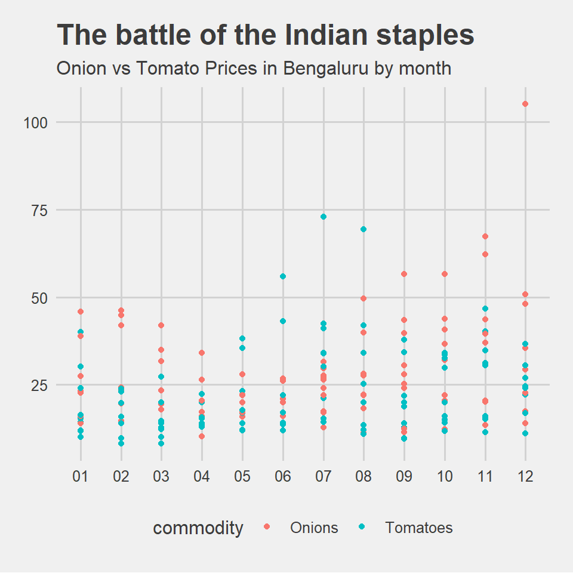

## Introduction

> Hey there! I'm Pranav Premkumar and I am someone who doesn't really like coding. The Python language had really put me away from venturing into this space for a long time! That was until I was introduced to the R language in our workshop. In a span of 2 weeks, I tried my best to grasp as much of the language as I could. This site captures a few of my attempts on data visualisation with R that came about as a result of a lot of whining and troubleshooting. Nevertheless, I am quite proud of the results!

## Graph 1 - Covid and its impact on Food Prices in India

The dataset I used for this graph is based on Food Prices in India across regions over a span of almost 3 decades. There are 133,137 rows & 13 columns in this dataset.

The variables are:

**Qualitative:**

* "date" <date> -> The date in yyyy-mm-dd format        
* "admin1" <chr> -> State in India
* "admin2" <chr> -> District 
* "market" <chr> -> City/Town  
* "latitude" <dbl> -> Latitude of City/Town
* "longitude" <dbl> -> Longitude of City/Town
* "category" <chr> -> Type of Commodity
* "commodity" <chr> -> Commodity
* "unit" <chr> -> Unit of mass of Commodity
* "pricetype" <chr> -> Price Type
* "currency" <chr> -> Currency Type - INR

**Quantitative:**

* "price" <dbl> -> Price in INR
* "usdprice" <dbl> -> Price in USD

**Link to the dataset:** https://data.world/wfp/dc663585-4b6f-46ae-a6d6-b2f3e4ea32b5


```r
India_FP <- read_csv("india-food-prices-1.csv")
```

```
## Rows: 133138 Columns: 13
## -- Column specification --------------------------------------------------------
## Delimiter: ","
## chr (13): date, admin1, admin2, market, latitude, longitude, category, commo...
## 
## i Use `spec()` to retrieve the full column specification for this data.
## i Specify the column types or set `show_col_types = FALSE` to quiet this message.
```

```r
India_FP <- India_FP[-1, ]
India_FP <- India_FP %>% mutate(date= lubridate::as_date(date)) %>% 
  mutate(price = as.numeric(price),
         usdprice = as.numeric(usdprice),
         latitude = as.numeric(latitude),
         longitude = as.numeric(longitude))

glimpse(India_FP)
```

```
## Rows: 133,137
## Columns: 13
## $ date      <date> 1994-01-15, 1994-01-15, 1994-01-15, 1994-01-15, 1994-01-15,~
## $ admin1    <chr> "Delhi", "Delhi", "Delhi", "Delhi", "Gujarat", "Gujarat", "G~
## $ admin2    <chr> "Delhi", "Delhi", "Delhi", "Delhi", "Ahmadabad", "Ahmadabad"~
## $ market    <chr> "Delhi", "Delhi", "Delhi", "Delhi", "Ahmedabad", "Ahmedabad"~
## $ latitude  <dbl> 28.66667, 28.66667, 28.66667, 28.66667, 23.03333, 23.03333, ~
## $ longitude <dbl> 77.21667, 77.21667, 77.21667, 77.21667, 72.61667, 72.61667, ~
## $ category  <chr> "cereals and tubers", "cereals and tubers", "miscellaneous f~
## $ commodity <chr> "Rice", "Wheat", "Sugar", "Oil (mustard)", "Rice", "Wheat", ~
## $ unit      <chr> "KG", "KG", "KG", "KG", "KG", "KG", "KG", "KG", "KG", "KG", ~
## $ pricetype <chr> "actual", "actual", "actual", "actual", "actual", "actual", ~
## $ currency  <chr> "INR", "INR", "INR", "INR", "INR", "INR", "INR", "INR", "INR~
## $ price     <dbl> 8.00, 5.00, 13.50, 31.00, 6.80, 6.20, 13.50, 30.00, 9.00, 13~
## $ usdprice  <dbl> 0.25, 0.16, 0.43, 0.99, 0.22, 0.20, 0.43, 0.95, 0.29, 0.44, ~
```

```r
India_FP %>% filter(unit != "100 KG", date >= "2018-12-15") %>% group_by(date, commodity) %>%
  summarise(mean_price = mean(price, na.rm = TRUE)) %>% 
  ggplot(data=., aes(x= date, y= mean_price, colour= commodity)) + geom_point()+ geom_vline(xintercept = as.numeric(lubridate::ymd("2020-01-27")), colour = "blue")+ labs(title = "Covid Food Prices Surge") 
```

```
## `summarise()` has grouped output by 'date'. You can override using the
## `.groups` argument.
```


Through this scatter plot, I could detect an overall price surge across commodities during Covid. However, the price of essential supplies, such as rice and wheat have risen by only a minute extent.

The blue line after 2020 is a marker of the first Covid case detected in India. 

## Graph 2 - Onion vs Tomato prices over a decade in Bengaluru

I used the same dataset as before to plot this graph. 


```r
#filtering by commodity and city
India_FP %>% mutate(month = format(date, "%m"), year = format(date, "%Y")) %>%
select(month, year, commodity, market, unit, price) %>% 
  filter(commodity == "Onions" | commodity == "Tomatoes", unit == "KG", market == "Bengaluru") %>% 
  ggplot(data=., aes(x= month, y = price, color = commodity, fill = commodity))+geom_point()+ labs(title = "The battle of the Indian staples", subtitle = "Onion vs Tomato Prices in Bengaluru by month")+ theme_fivethirtyeight()
```


This graph is a price comparison between Onions and Tomatoes. I have overlapped the prices of these 2 commodities across a decade for each month. An interesting observation is that the price of Tomatoes is higher from May to August whereas during other months, the price of Onions is higher. 

## ~Graph 3~ Map 1 - Mapping the migration of a white stork.

To create this map, I used a 2 datasets called "points" and "lines" which essentially capture the coordinates of the various places the white stork has been to!


```r
animal_points <- st_read("./Data2/points.shp")
```

```
## Reading layer `points' from data source 
##   `C:\Users\Arvind\My Drive\R work\MyWebsites\dtt-2021-2022\content\portfolio\Pranav Premkumar\Data2\points.shp' 
##   using driver `ESRI Shapefile'
## Simple feature collection with 119392 features and 34 fields
## Geometry type: POINT
## Dimension:     XY
## Bounding box:  xmin: 15.99268 ymin: -23.95106 xmax: 42.58018 ymax: 41.5113
## Geodetic CRS:  WGS 84
```

```r
animal_lines <- st_read("./Data2/lines.shp")
```

```
## Reading layer `lines' from data source 
##   `C:\Users\Arvind\My Drive\R work\MyWebsites\dtt-2021-2022\content\portfolio\Pranav Premkumar\Data2\lines.shp' 
##   using driver `ESRI Shapefile'
## Simple feature collection with 20 features and 1 field (with 10 geometries empty)
## Geometry type: LINESTRING
## Dimension:     XY
## Bounding box:  xmin: 15.99268 ymin: -23.95106 xmax: 42.58018 ymax: 41.5113
## Geodetic CRS:  WGS 84
```

Describe briefly what graph you are going to plot


```r
data("World")
migration_countries <-  World %>% filter(name %in% c("Greece", "Turkey", "Syria", "Israel", "Lebanon", "Palestine", "Egypt", "Jordan", "Sudan", "Chad", "Saudi Arabia", "S. Sudan", "Ethiopia", "Kenya", "Tanzania", "Uganda", "Zimbabwe", "Botswana", "South Africa", "Zambia", "Malawi", "Mozambique", "Cyprus", "Central African Rep."))
```


```r
tmap_style(style = "natural")+

tm_shape(migration_countries) +
  tm_polygons(col = "gray30") +

tm_shape(animal_lines) +
  tm_lines(col = "green2") +

 
tm_shape(animal_points) +
  tm_dots(col = "hotpink", size = 0.01)
```

```
## tmap style set to "natural"
```

```
## other available styles are: "white", "gray", "cobalt", "col_blind", "albatross", "beaver", "bw", "classic", "watercolor"
```

```
## Warning: The shape animal_lines contains empty units.
```


The stork's journey took it from the Evros Delta, in north eastern Greece to various locations across the Middle East and Africa, the farthest being in Limpopo, South Africa!

## My Course Reflection

As I had mentioned before, coding has always been something that has overwhelmed me. There were situations over the past 2 weeks where I just wanted to give up when something didn't work. But I guess the only way I get rid of this fear is by coding more often. I wish this workshop spanned more than just 2 weeks, since the extra time span would have given me the opportunity to work at my pace, to do a series of trials and errors until I've actually figured how the code really works. 

I do see how this language is beneficial in the area of data visualisation, in helping us "see the unseen". I am however currently unable to anticipate how I could use this skill in my design practice. But, as it has always been with any sort of skill I have acquired, they come to use in the most unexpected situations I could ever think of! 

Also, I hope I didn't tire Arvind with the barrage of questions I posed at him every class. Thank you for patiently answering all my questions! It definitely helped me stay afloat in the R ocean. I hope I don't hear any aRRRs in the distance though 0_o 
