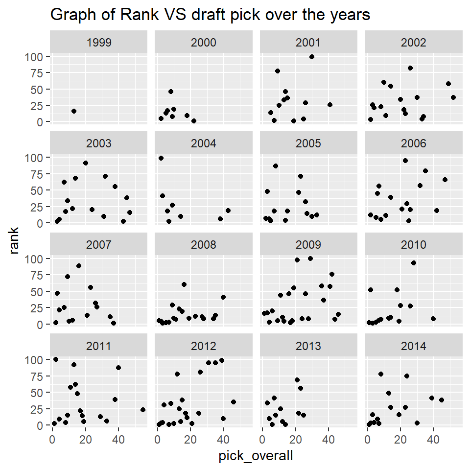
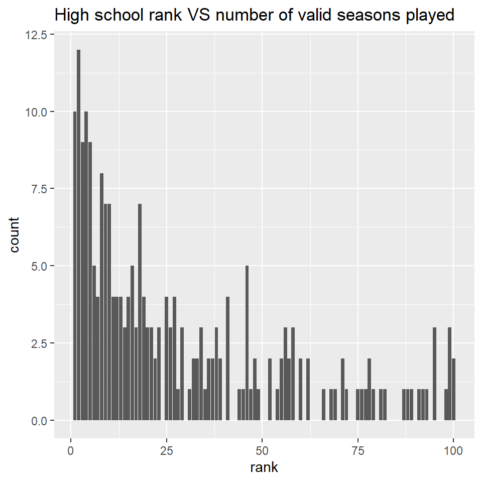
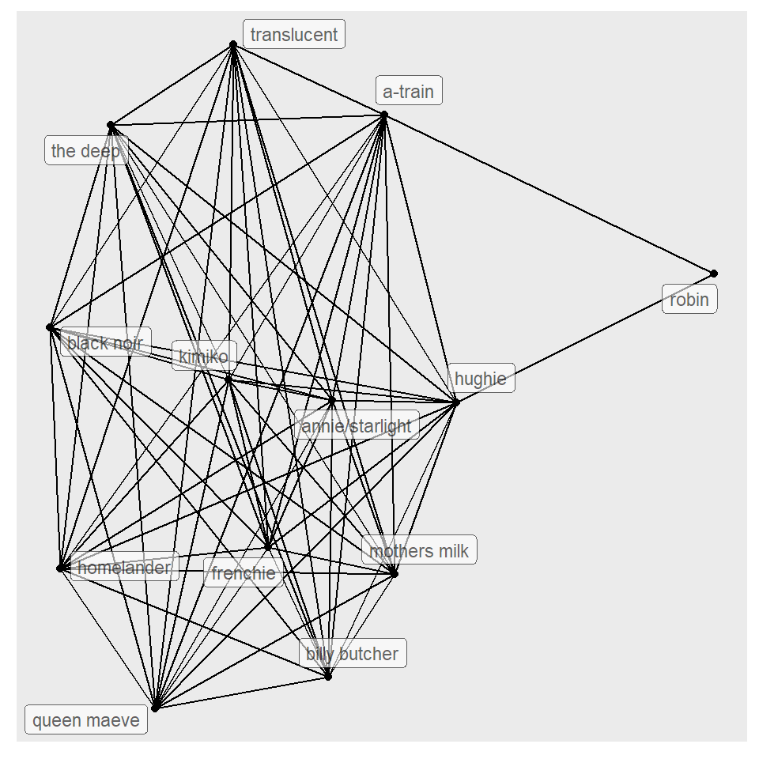

## Introduction

My name is Pulkit Kishore and I was part of the workshop, Digital Thinking Tools with Arvind Venkatadri.

## Graph 1

 The datasets I've chosen are on high school players that made it to the NBA and other information on their journey to the NBA, and another


```r
my_data_1 <- read_csv("players.csv")
glimpse(my_data_1)
```

```
## Rows: 1,873
## Columns: 30
## $ name               <chr> "Al Harrington", "Rashard Lewis", "Korleone Young",~
## $ link               <chr> "/players/h/harrial01.html", "/players/l/lewisra02.~
## $ rank               <dbl> 1, 2, 3, 4, 5, 6, 7, 8, 9, 10, 11, 12, 13, 14, 14, ~
## $ draft_year         <dbl> 1998, 1998, 1998, 2002, 2000, NA, NA, 2000, 2000, N~
## $ draft_rd           <dbl> 1, 2, 2, 2, 1, NA, NA, 1, 1, NA, 2, 1, 1, NA, NA, N~
## $ draft_pk           <dbl> 25, 32, 40, 34, 2, NA, NA, 9, 18, NA, 33, 23, 5, NA~
## $ college            <chr> NA, NA, NA, "University of California, Los Angeles"~
## $ recruit_year       <dbl> 1998, 1998, 1998, 1998, 1998, 1998, 1998, 1998, 199~
## $ bbrID              <chr> "harrial01", "lewisra02", "youngko01", "gadzuda01",~
## $ pick_overall       <dbl> 25, 32, 40, 33, 2, NA, NA, 9, 18, NA, 32, 23, 5, NA~
## $ pick_number        <dbl> 25, 32, 40, 34, 2, NA, NA, 9, 18, NA, 33, 23, 5, NA~
## $ pick_round         <dbl> 1, 2, 2, 2, 1, NA, NA, 1, 1, NA, 2, 1, 1, NA, NA, N~
## $ nba_mean_ws48      <dbl> 0.07390909, 0.13525000, NA, 0.14000000, 0.12450000,~
## $ nba_mean_vorp      <dbl> 0.5363636, 2.8583333, NA, 0.9000000, 0.4500000, NA,~
## $ nba_mean_pipm      <dbl> -0.9054545, 1.5325000, NA, 1.5500000, -1.3100000, N~
## $ nba_mean_wa        <dbl> 2.030000, 7.520833, NA, 4.600000, 0.970000, NA, NA,~
## $ top_mean_ws48      <dbl> 0.0958000, 0.1556000, NA, 0.1400000, 0.1245000, NA,~
## $ top_mean_vorp      <dbl> 0.900, 3.780, NA, 0.900, 0.450, NA, NA, 1.000, 1.72~
## $ top_mean_pipm      <dbl> 0.2820000, 3.1420000, NA, 1.5500000, -1.3100000, NA~
## $ top_mean_wa        <dbl> 3.946000, 11.672000, NA, 4.600000, 0.970000, NA, NA~
## $ nba_mean_ws48_rank <dbl> 134.36364, 55.91667, NA, 47.00000, 68.50000, NA, NA~
## $ nba_mean_vorp_rank <dbl> 129.72727, 44.41667, NA, 108.00000, 125.00000, NA, ~
## $ nba_mean_pipm_rank <dbl> 122.18182, 56.08333, NA, 53.00000, 119.50000, NA, N~
## $ nba_mean_wa_rank   <dbl> 118.72727, 55.16667, NA, 73.00000, 127.00000, NA, N~
## $ top_mean_ws48_rank <dbl> 109.6, 32.4, NA, 47.0, 68.5, NA, NA, 60.0, 95.2, NA~
## $ top_mean_vorp_rank <dbl> 114.0000, 21.8000, NA, 108.0000, 125.0000, NA, NA, ~
## $ top_mean_pipm_rank <dbl> 86.80, 19.40, NA, 53.00, 119.50, NA, NA, 80.00, 69.~
## $ top_mean_wa_rank   <dbl> 79.80, 18.20, NA, 73.00, 127.00, NA, NA, 88.00, 75.~
## $ total_seasons      <dbl> 16, 16, 1, 10, 9, NA, NA, 13, 13, NA, 1, 14, 17, NA~
## $ valid_seasons      <dbl> 11, 12, 0, 1, 2, NA, NA, 3, 7, NA, 0, 11, 11, NA, N~
```

Describe briefly what graph you are going to plot


```r
players <- my_data_1 %>% drop_na()
ggplot(players, 
       mapping = aes(x = pick_overall, 
           y = rank)) + 
  geom_point() +
  
    facet_wrap(~draft_year) +

  ggtitle("Graph of Rank VS draft pick over the years")
```



This graph shows how the pick overall number and high school rank has changed per year. the geometric aesthetics i used were facet wrap to show the change over the years.

## Graph 2

This dataset tells about the journey high school baskletball players make in their potential NBA careers. it does so using highschool rank, college recruit year, college name, NBA pick overall, total seasons and other such columns.


```r
my_data_2 <- read_csv("players.csv")
glimpse(my_data_2)
```

```
## Rows: 1,873
## Columns: 30
## $ name               <chr> "Al Harrington", "Rashard Lewis", "Korleone Young",~
## $ link               <chr> "/players/h/harrial01.html", "/players/l/lewisra02.~
## $ rank               <dbl> 1, 2, 3, 4, 5, 6, 7, 8, 9, 10, 11, 12, 13, 14, 14, ~
## $ draft_year         <dbl> 1998, 1998, 1998, 2002, 2000, NA, NA, 2000, 2000, N~
## $ draft_rd           <dbl> 1, 2, 2, 2, 1, NA, NA, 1, 1, NA, 2, 1, 1, NA, NA, N~
## $ draft_pk           <dbl> 25, 32, 40, 34, 2, NA, NA, 9, 18, NA, 33, 23, 5, NA~
## $ college            <chr> NA, NA, NA, "University of California, Los Angeles"~
## $ recruit_year       <dbl> 1998, 1998, 1998, 1998, 1998, 1998, 1998, 1998, 199~
## $ bbrID              <chr> "harrial01", "lewisra02", "youngko01", "gadzuda01",~
## $ pick_overall       <dbl> 25, 32, 40, 33, 2, NA, NA, 9, 18, NA, 32, 23, 5, NA~
## $ pick_number        <dbl> 25, 32, 40, 34, 2, NA, NA, 9, 18, NA, 33, 23, 5, NA~
## $ pick_round         <dbl> 1, 2, 2, 2, 1, NA, NA, 1, 1, NA, 2, 1, 1, NA, NA, N~
## $ nba_mean_ws48      <dbl> 0.07390909, 0.13525000, NA, 0.14000000, 0.12450000,~
## $ nba_mean_vorp      <dbl> 0.5363636, 2.8583333, NA, 0.9000000, 0.4500000, NA,~
## $ nba_mean_pipm      <dbl> -0.9054545, 1.5325000, NA, 1.5500000, -1.3100000, N~
## $ nba_mean_wa        <dbl> 2.030000, 7.520833, NA, 4.600000, 0.970000, NA, NA,~
## $ top_mean_ws48      <dbl> 0.0958000, 0.1556000, NA, 0.1400000, 0.1245000, NA,~
## $ top_mean_vorp      <dbl> 0.900, 3.780, NA, 0.900, 0.450, NA, NA, 1.000, 1.72~
## $ top_mean_pipm      <dbl> 0.2820000, 3.1420000, NA, 1.5500000, -1.3100000, NA~
## $ top_mean_wa        <dbl> 3.946000, 11.672000, NA, 4.600000, 0.970000, NA, NA~
## $ nba_mean_ws48_rank <dbl> 134.36364, 55.91667, NA, 47.00000, 68.50000, NA, NA~
## $ nba_mean_vorp_rank <dbl> 129.72727, 44.41667, NA, 108.00000, 125.00000, NA, ~
## $ nba_mean_pipm_rank <dbl> 122.18182, 56.08333, NA, 53.00000, 119.50000, NA, N~
## $ nba_mean_wa_rank   <dbl> 118.72727, 55.16667, NA, 73.00000, 127.00000, NA, N~
## $ top_mean_ws48_rank <dbl> 109.6, 32.4, NA, 47.0, 68.5, NA, NA, 60.0, 95.2, NA~
## $ top_mean_vorp_rank <dbl> 114.0000, 21.8000, NA, 108.0000, 125.0000, NA, NA, ~
## $ top_mean_pipm_rank <dbl> 86.80, 19.40, NA, 53.00, 119.50, NA, NA, 80.00, 69.~
## $ top_mean_wa_rank   <dbl> 79.80, 18.20, NA, 73.00, 127.00, NA, NA, 88.00, 75.~
## $ total_seasons      <dbl> 16, 16, 1, 10, 9, NA, NA, 13, 13, NA, 1, 14, 17, NA~
## $ valid_seasons      <dbl> 11, 12, 0, 1, 2, NA, NA, 3, 7, NA, 0, 11, 11, NA, N~
```

this graph will show the relationship between the high school rank of a player in High school and the number of valid seasons that they play in the future in the NBA.

```r
players <- my_data_2 %>% drop_na()


ggplot(players, 
       mapping = aes(x = rank, 
           fill = valid_seasons)) +  
  geom_bar()+
  ggtitle("High school rank VS number of valid seasons played")
```


I used geom_bar to represent data with the fill being the valid seasons they play. I used this as i think it effectively conveys the number of players who play such seasons and the rank they have.

## Graph 3

Network graph made on the TV show "The Boys" where my partner and I created a dataset about the different interactions that each character has with each other.


```r
the_boys_nodes <- read_delim("./The boys Nodes.csv", delim = ",")
the_boys_edges <- read_delim("./FINAL Edges THE BOYS.csv", delim = ",")
the_boys_nodes
```

```
## # A tibble: 13 x 9
##       id gender relation species life  race     group     `kill count` name     
##    <dbl> <chr>  <chr>    <chr>   <chr> <chr>    <chr>            <dbl> <chr>    
##  1     1 female taken    human   dead  biracial <NA>                 0 robin    
##  2     2 male   single   human   alive white    the boys             2 hughie   
##  3     3 female taken    supe    alive white    the seven            1 annie/st~
##  4     4 male   taken    human   alive white    the boys             7 billy bu~
##  5     5 male   taken    human   alive black    the boys             0 mothers ~
##  6     6 male   single   human   alive white    the boys             0 frenchie 
##  7     7 male   single   supe    alive asian    the boys             8 kimiko   
##  8     8 male   single   supe    alive white    the seven          159 homeland~
##  9     9 male   single   supe    alive white    the seven            0 the deep 
## 10    10 male   single   supe    dead  white    the seven            0 transluc~
## 11    11 female taken    supe    alive white    the seven            2 queen ma~
## 12    12 male   single   supe    alive black    the seven            5 black no~
## 13    13 male   taken    supe    alive black    the seven            2 a-train
```

```r
the_boys_nodes
```

```
## # A tibble: 13 x 9
##       id gender relation species life  race     group     `kill count` name     
##    <dbl> <chr>  <chr>    <chr>   <chr> <chr>    <chr>            <dbl> <chr>    
##  1     1 female taken    human   dead  biracial <NA>                 0 robin    
##  2     2 male   single   human   alive white    the boys             2 hughie   
##  3     3 female taken    supe    alive white    the seven            1 annie/st~
##  4     4 male   taken    human   alive white    the boys             7 billy bu~
##  5     5 male   taken    human   alive black    the boys             0 mothers ~
##  6     6 male   single   human   alive white    the boys             0 frenchie 
##  7     7 male   single   supe    alive asian    the boys             8 kimiko   
##  8     8 male   single   supe    alive white    the seven          159 homeland~
##  9     9 male   single   supe    alive white    the seven            0 the deep 
## 10    10 male   single   supe    dead  white    the seven            0 transluc~
## 11    11 female taken    supe    alive white    the seven            2 queen ma~
## 12    12 male   single   supe    alive black    the seven            5 black no~
## 13    13 male   taken    supe    alive black    the seven            2 a-train
```

```r
glimpse(the_boys_nodes)
```

```
## Rows: 13
## Columns: 9
## $ id           <dbl> 1, 2, 3, 4, 5, 6, 7, 8, 9, 10, 11, 12, 13
## $ gender       <chr> "female", "male", "female", "male", "male", "male", "male~
## $ relation     <chr> "taken", "single", "taken", "taken", "taken", "single", "~
## $ species      <chr> "human", "human", "supe", "human", "human", "human", "sup~
## $ life         <chr> "dead", "alive", "alive", "alive", "alive", "alive", "ali~
## $ race         <chr> "biracial", "white", "white", "white", "black", "white", ~
## $ group        <chr> NA, "the boys", "the seven", "the boys", "the boys", "the~
## $ `kill count` <dbl> 0, 2, 1, 7, 0, 0, 8, 159, 0, 0, 2, 5, 2
## $ name         <chr> "robin", "hughie", "annie/starlight", "billy butcher", "m~
```

```r
glimpse(the_boys_edges)
```

```
## Rows: 68
## Columns: 6
## $ from   <dbl> 2, 2, 2, 2, 2, 2, 2, 2, 2, 2, 2, 2, 4, 4, 4, 4, 4, 4, 4, 4, 4, ~
## $ to     <dbl> 1, 3, 4, 5, 6, 7, 8, 9, 10, 11, 12, 13, 5, 6, 7, 8, 9, 10, 11, ~
## $ weight <dbl> 7, 7, 6, 5, 5, 3, 1, 1, 1, 1, 1, 1, 6, 6, 4, 1, 1, 1, 1, 1, 1, ~
## $ type   <chr> "love", "love", "friend", "friend", "friend", "friend", "enemy"~
## $ name1  <chr> "hughie", "hughie", "hughie", "hughie", "hughie", "hughie", "hu~
## $ name2  <chr> "robin", "annie/starlight", "billy butcher", "mothers milk", "f~
```


```r
tb <- tbl_graph(nodes = the_boys_nodes,
                edges = the_boys_edges, 
                directed = FALSE)
tb
```

```
## # A tbl_graph: 13 nodes and 68 edges
## #
## # An undirected simple graph with 1 component
## #
## # Node Data: 13 x 9 (active)
##      id gender relation species life  race     group     `kill count` name      
##   <dbl> <chr>  <chr>    <chr>   <chr> <chr>    <chr>            <dbl> <chr>     
## 1     1 female taken    human   dead  biracial <NA>                 0 robin     
## 2     2 male   single   human   alive white    the boys             2 hughie    
## 3     3 female taken    supe    alive white    the seven            1 annie/sta~
## 4     4 male   taken    human   alive white    the boys             7 billy but~
## 5     5 male   taken    human   alive black    the boys             0 mothers m~
## 6     6 male   single   human   alive white    the boys             0 frenchie  
## # ... with 7 more rows
## #
## # Edge Data: 68 x 6
##    from    to weight type   name1  name2          
##   <int> <int>  <dbl> <chr>  <chr>  <chr>          
## 1     1     2      7 love   hughie robin          
## 2     2     3      7 love   hughie annie/starlight
## 3     2     4      6 friend hughie billy butcher  
## # ... with 65 more rows
```

I am plotting a network graph connecting the different characters within the story of the TV show "The Boys".

```r
ggraph(graph = tb, layout = "fr") +
  geom_edge_link0() + 
  
  geom_node_point() + 
   geom_node_label(aes(label = name), # modify this mapping
                  repel = TRUE, max.overlaps = 20,
                 alpha = 0.6,
                size = 3) 
```


I learnt about the connection made within the dataset I made and how the fictional characters are connected to each other, enhancing and analysing the plot of the show

## My Course Reflection

This course was about data visualization where we used R programming to create plots and use datasets to form stories. I found that making such graphs really helped bring a story to life as it made it easier for the viewers to understand patterns within datasets and thier implications.

I learnt that networking and making these graphs is useful in any situation and environment. I learnt the techincal skills required to preliminarily code in R using packages and datasets from the internet. Finally i learnt how to make a new dataset of my own, forming columns and rows. 

It will help me as a designer as it allows me to make graphs using code, and have the freedom to conduct research and analyse the data found to create stories and more effectively send my message

Arvind is a horrible teacher and simply does not get what we need. Only Arvind should be allowed to teach more in Srishti.

Etc.

Jai Hind.
