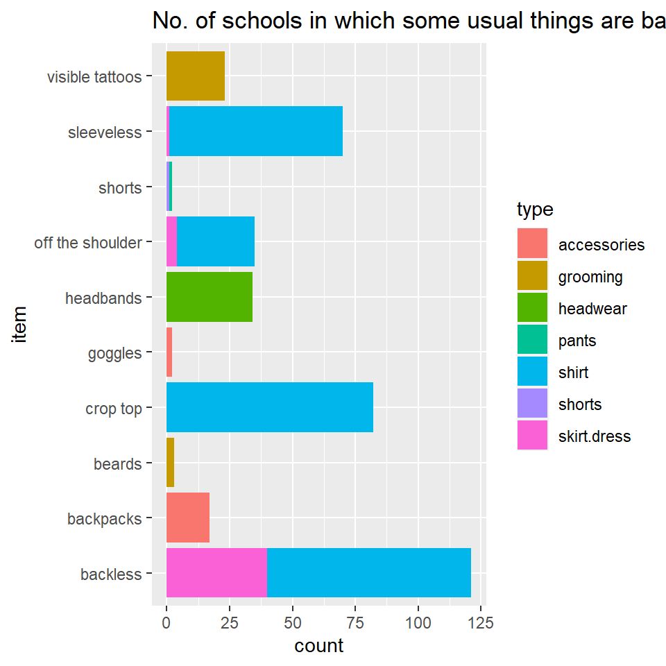

## Introduction

> Hello folks! I am Siddhant Rander, and The cool stuff I did inside with graphs and maps and later networking Brooklyn 99 characters is the reason I can say "I love coding"

## Graph 1

The Banned Items in US contains a dataset of the names of schools, the states they belong to, type of item and the name of item banned in that school.  
schoolName -> 480 different schools  
state -> 38 States of USA  
type -> 14 types of items  
item -> 1071 different items


```
## Rows: 15,144
## Columns: 5
## $ schoolName <chr> "RUSK H S", "RUSK H S", "EAST HIGH", "TOMAHAWK HIGH", "TOMA~
## $ state      <chr> "TX", "TX", "UT", "WI", "WI", "WI", "WI", "WI", "OK", "TX",~
## $ item       <chr> "pillows", "stuffed animals", "dangling belts", "wallet cha~
## $ type       <chr> "accessories", "accessories", "accessories", "accessories",~
## $ prohibited <chr> "none", "none", "none", "none", "none", "none", "none", "no~
```

#### USUAL ITEMS BANNED
In this data, I have used this data to find out how many schools have banned the things that seem very usual to us and astonished to see it being banned. 



In this graph, out of the 1071 unique items, I filtered out some items, and plotted it on the graph to see out of 480 schools, how many have banned it. 
I used the filter command to filter, then used the aesthetics of assigning the _X Axis to items_ and _fill by type of item banned_ to give a better idea of the type. 

It was very interesting to see how backless and crop tops were banned in so many schools, and even something as normal as sleeveless. 

## Graph 2

 


```
## Reading layer `Indirabuildings' from data source 
##   `C:\Users\Arvind\My Drive\R work\MyWebsites\dtt-2021-2022\content\portfolio\Siddhant Rander\Indirabuildings.gpkg' 
##   using driver `GPKG'
## Simple feature collection with 20556 features and 103 fields
## Geometry type: POLYGON
## Dimension:     XY
## Bounding box:  xmin: 77.61977 ymin: 12.95243 xmax: 77.66186 ymax: 12.99524
## Geodetic CRS:  WGS 84
```

```
## Reading layer `IndiraParks' from data source 
##   `C:\Users\Arvind\My Drive\R work\MyWebsites\dtt-2021-2022\content\portfolio\Siddhant Rander\IndiraParks.gpkg' 
##   using driver `GPKG'
## Simple feature collection with 67 features and 12 fields
## Geometry type: POLYGON
## Dimension:     XY
## Bounding box:  xmin: 77.62193 ymin: 12.95306 xmax: 77.65987 ymax: 12.98753
## Geodetic CRS:  WGS 84
```

```
## Reading layer `IndiraGreenery' from data source 
##   `C:\Users\Arvind\My Drive\R work\MyWebsites\dtt-2021-2022\content\portfolio\Siddhant Rander\IndiraGreenery.gpkg' 
##   using driver `GPKG'
## Simple feature collection with 8 features and 3 fields
## Geometry type: POLYGON
## Dimension:     XY
## Bounding box:  xmin: 77.6264 ymin: 12.96054 xmax: 77.64818 ymax: 12.98204
## Geodetic CRS:  WGS 84
```

```
## Reading layer `IndiraTrees' from data source 
##   `C:\Users\Arvind\My Drive\R work\MyWebsites\dtt-2021-2022\content\portfolio\Siddhant Rander\IndiraTrees.gpkg' 
##   using driver `GPKG'
## Simple feature collection with 1680 features and 19 fields
## Geometry type: POINT
## Dimension:     XY
## Bounding box:  xmin: 77.6225 ymin: 12.95737 xmax: 77.65363 ymax: 12.98639
## Geodetic CRS:  WGS 84
```

```
## Reading layer `IndiraRoads' from data source 
##   `C:\Users\Arvind\My Drive\R work\MyWebsites\dtt-2021-2022\content\portfolio\Siddhant Rander\IndiraRoads.gpkg' 
##   using driver `GPKG'
## Simple feature collection with 1312 features and 35 fields
## Geometry type: LINESTRING
## Dimension:     XY
## Bounding box:  xmin: 77.61857 ymin: 12.95062 xmax: 77.66311 ymax: 12.9951
## Geodetic CRS:  WGS 84
```

```
## Reading layer `RestaurantsInIndira279' from data source 
##   `C:\Users\Arvind\My Drive\R work\MyWebsites\dtt-2021-2022\content\portfolio\Siddhant Rander\RestaurantsInIndira279.gpkg' 
##   using driver `GPKG'
## Simple feature collection with 279 features and 39 fields
## Geometry type: POINT
## Dimension:     XY
## Bounding box:  xmin: 77.62174 ymin: 12.95449 xmax: 77.6597 ymax: 12.98257
## Geodetic CRS:  WGS 84
```

```
## Warning: Expected 3 pieces. Additional pieces discarded in 2 rows [14, 81].
```

```
## Warning: Expected 3 pieces. Missing pieces filled with `NA` in 87 rows [1, 2, 3,
## 4, 5, 6, 7, 8, 9, 10, 11, 12, 13, 15, 16, 17, 18, 19, 20, 21, ...].
```

```
## Warning: Expected 3 pieces. Missing pieces filled with `NA` in 90 rows [1, 2, 3,
## 4, 5, 6, 7, 8, 9, 10, 11, 12, 13, 14, 15, 16, 17, 18, 19, 20, ...].
```

The below is a map of Indiranagar, Bangalore.  
Burlywood colours -> buildings
Grey -> Roads
Dark Green Shapes -> parks
Trees -> Light Green
Restaurants -> Yellow

This is an interactive map.


## Network of Brooklyn 99 characters

This is a data of Brooklyn 99 characters and the links and strength of links they have with other characters in the show. Using R's algorithms, it has formed communities and formed the network. 


This graph is an interactive graph of B99 Characters categorised by male and female. It shows the connections of each character. 


```{=html}
<div id="htmlwidget-7d1199e0daf73b4ab6a7" style="width:480px;height:480px;" class="visNetwork html-widget"></div>
<script type="application/json" data-for="htmlwidget-7d1199e0daf73b4ab6a7">{"x":{"nodes":{"id":[1,2,3,4,5,6,7,8,9,10,11,12,13,14,15,16,17,18,19,20],"label":["Jake Peralta","Rosa Diaz","Terry Jeffords","Amy Santiago","Charles Boyle","Gina Linetti","Raymond Holt","Michael Hitchcock","Norm Scully","Milepnos","Doug Judy","Vulture","Sharron Jeffords","Kevin Cozner","Bob Anderrson","Trudy Judy","Nikolaj Boyle","Adrian Pimento","Maura Figgis","Steve Boyle"],"ID":[1,2,3,4,5,6,7,8,9,10,11,12,13,14,15,16,17,18,19,20],"group":["Male","Female","Male","Female","Male","Female","Male","Male","Male","Male","Male","Male","Female","Male","Male","Female","Male","Male","Female","Male"],"role":["Detective","Detective","Sargeant","Detective","Detective","Personal Assistant","Captain","Detective","Detective","Citizen","Criminal","Captain","Family","Family","FBI Agent","Criminal","Family","Detective","Criminal","Family"],"pers.trait":["immature","violent","protective","competitive","eccentric","narcissistic","serious","lazy","lazy","confused","immature","obnoxious","kind","serious","serious","cunning","kind","violent","violent","attention seeking"],"obsessions":["Die Hard","Swords","Yogurt","Binders","food","herself","discipline","food","food","dance","Die Hard","power","kids","discipline","discipline","boys","police toys","self harm","Charles Boyle","cousins"]},"edges":{"from":[1,1,1,1,1,1,1,1,1,1,1,1,1,1,1,1,1,2,2,2,2,2,2,2,2,2,2,2,3,3,3,3,3,3,3,3,3,3,4,4,4,4,4,4,4,4,4,4,4,4,6,6,6,6,6,6,6,6,5,5,5,5,5,5,5,5,5,5,5,7,7,7,7,7,7,7,7,8,8,8,9,9,11,2],"to":[4,5,6,7,8,9,10,11,12,13,14,15,16,17,18,2,3,3,4,5,6,7,8,9,14,15,18,11,12,4,5,6,7,8,9,13,15,18,18,12,5,6,7,8,9,10,11,14,15,19,5,7,8,9,12,13,14,18,14,12,7,8,9,15,13,17,18,19,20,8,9,11,12,13,14,15,18,9,18,12,18,12,16,12]},"nodesToDataframe":true,"edgesToDataframe":true,"options":{"width":"100%","height":"100%","nodes":{"shape":"dot","font":{"size":20}},"manipulation":{"enabled":false},"layout":{"randomSeed":12345},"edges":{"title":{"from":[1,1,1,1,1,1,1,1,1,1,1,1,1,1,1,1,1,2,2,2,2,2,2,2,2,2,2,2,3,3,3,3,3,3,3,3,3,3,4,4,4,4,4,4,4,4,4,4,4,4,6,6,6,6,6,6,6,6,5,5,5,5,5,5,5,5,5,5,5,7,7,7,7,7,7,7,7,8,8,8,9,9,11,2],"to":[4,5,6,7,8,9,10,11,12,13,14,15,16,17,18,2,3,3,4,5,6,7,8,9,14,15,18,11,12,4,5,6,7,8,9,13,15,18,18,12,5,6,7,8,9,10,11,14,15,19,5,7,8,9,12,13,14,18,14,12,7,8,9,15,13,17,18,19,20,8,9,11,12,13,14,15,18,9,18,12,18,12,16,12]}},"groups":{"Female":{"shape":"icon","icon":{"face":"Ionicons","code":"f25d","color":"lightpink","size":125}},"useDefaultGroups":true,"Male":{"shape":"icon","icon":{"face":"Ionicons","code":"f202","color":"lightblue","size":125}}},"interaction":{"hover":true,"hoverConnectedEdges":true,"navigationButtons":true,"selectConnectedEdges":true,"zoomView":true,"zoomSpeed":1}},"groups":["Male","Female"],"width":null,"height":null,"idselection":{"enabled":false},"byselection":{"enabled":false},"main":null,"submain":null,"footer":null,"background":"rgba(0, 0, 0, 0)","legend":{"width":0.2,"useGroups":true,"position":"left","ncol":1,"stepX":100,"stepY":100,"zoom":true},"iconsRedraw":true,"tooltipStay":300,"tooltipStyle":"position: fixed;visibility:hidden;padding: 5px;white-space: nowrap;font-family: verdana;font-size:14px;font-color:#000000;background-color: #f5f4ed;-moz-border-radius: 3px;-webkit-border-radius: 3px;border-radius: 3px;border: 1px solid #808074;box-shadow: 3px 3px 10px rgba(0, 0, 0, 0.2);"},"evals":[],"jsHooks":[]}</script>
```


## My Course Reflection

This course was about using R to plot graphs, maps and networks. 

I learnt about the importance of numbers and the magic data visualisation can do to a human as it makes the data so much easier to read. The things we learnt in 5th Std about plotting graphs and how relevant it is in today's world based on data. I learnt the right ways it could be used and learning to plot networks will be one of the major takeaways from this course as network science can change the way I look at communities, and how small the world could become due to networks.

It will help me be a better designer and one of the use cases I can think of is that as a UX UI designer when I conduct surveys to form personas, the data could be visualised and worked better using R. 

Thank you Arvind for this workshop!
