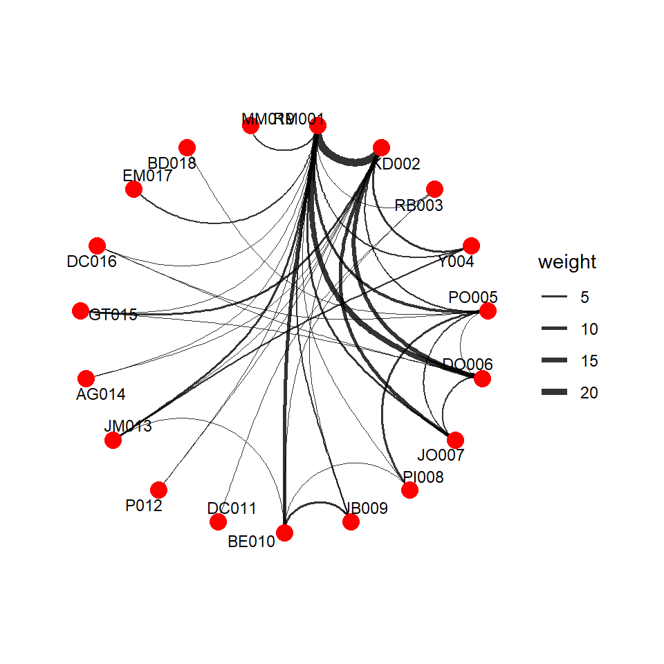
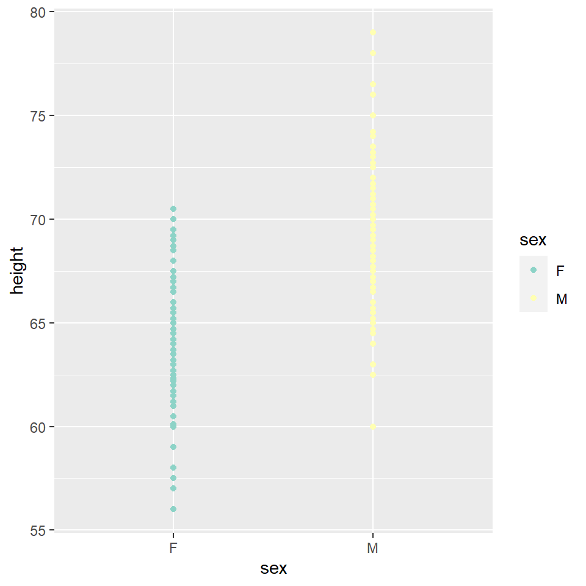

## Introduction

Hey ! I'm Sneha Patel !I will be going to represent what I have done in this workshop based on 'R' 

## Graph 1


```
## Rows: 39
## Columns: 4
## $ From            <chr> "AG014", "AG014", "BE010", "BE010", "BE010", "BE010", ~
## $ To              <chr> "RM001", "KD002", "JB009", "RB003", "RM001", "PI008", ~
## $ Weight          <dbl> 2, 1, 6, 1, 10, 1, 1, 1, 1, 2, 16, 4, 2, 5, 3, 2, 3, 5~
## $ `Relation Type` <chr> "situational", "situational", "professional", "situati~
```

```
## Rows: 19
## Columns: 4
## $ Name     <chr> "RM001", "KD002", "RB003", "Y004", "PO005", "DO006", "JO007",~
## $ Sex      <chr> "M", "F", "F", "M", "F", "M", "M", "M", "M", "F", "M", "M", "~
## $ Race     <chr> "White", "Slavic", "White", "White", "White", "Black", "White~
## $ Position <chr> "Professor", "Phdstudent", "singer", "Kate's boyfriend", "Pre~
```

```
## # A tbl_graph: 19 nodes and 39 edges
## #
## # An undirected simple graph with 1 component
## #
## # Node Data: 19 x 4 (active)
##   Name  Sex   Race   Position        
##   <chr> <chr> <chr>  <chr>           
## 1 RM001 M     White  Professor       
## 2 KD002 F     Slavic Phdstudent      
## 3 RB003 F     White  singer          
## 4 Y004  M     White  Kate's boyfriend
## 5 PO005 F     White  President       
## 6 DO006 M     Black  head of TPDC    
## # ... with 13 more rows
## #
## # Edge Data: 39 x 4
##    from    to Weight `Relation Type`
##   <int> <int>  <dbl> <chr>          
## 1     1    14      2 situational    
## 2     2    14      1 situational    
## 3     9    10      6 professional   
## # ... with 36 more rows
```

### The network of the characters showing the weight of the interactions they have had in the movie


```
## Warning in grid.Call(C_stringMetric, as.graphicsAnnot(x$label)): font family not
## found in Windows font database

## Warning in grid.Call(C_stringMetric, as.graphicsAnnot(x$label)): font family not
## found in Windows font database
```

```
## Warning in grid.Call(C_textBounds, as.graphicsAnnot(x$label), x$x, x$y, : font
## family not found in Windows font database

## Warning in grid.Call(C_textBounds, as.graphicsAnnot(x$label), x$x, x$y, : font
## family not found in Windows font database
```



**Story:** The circular graph does show the interactions each character had with the other. The thickest line is the one shared between the two main characters and that does correlate to what we saw in the movie.


## Graph 2

Brief introduction of your chosen data set Describe the interesting
columns and what they mean


```
## # A tibble: 133,137 x 13
##    date       admin1   admin2 market latitude longitude category commodity unit 
##    <date>     <chr>    <chr>  <chr>     <dbl>     <dbl> <chr>    <chr>     <chr>
##  1 1994-01-15 Delhi    Delhi  Delhi      28.7      77.2 cereals~ Rice      KG   
##  2 1994-01-15 Delhi    Delhi  Delhi      28.7      77.2 cereals~ Wheat     KG   
##  3 1994-01-15 Delhi    Delhi  Delhi      28.7      77.2 miscell~ Sugar     KG   
##  4 1994-01-15 Delhi    Delhi  Delhi      28.7      77.2 oil and~ Oil (mus~ KG   
##  5 1994-01-15 Gujarat  Ahmad~ Ahmed~     23.0      72.6 cereals~ Rice      KG   
##  6 1994-01-15 Gujarat  Ahmad~ Ahmed~     23.0      72.6 cereals~ Wheat     KG   
##  7 1994-01-15 Gujarat  Ahmad~ Ahmed~     23.0      72.6 miscell~ Sugar     KG   
##  8 1994-01-15 Gujarat  Ahmad~ Ahmed~     23.0      72.6 oil and~ Oil (mus~ KG   
##  9 1994-01-15 Himacha~ Shimla Shimla     31.1      77.2 cereals~ Rice      KG   
## 10 1994-01-15 Himacha~ Shimla Shimla     31.1      77.2 miscell~ Sugar     KG   
## # ... with 133,127 more rows, and 4 more variables: pricetype <chr>,
## #   currency <chr>, price <dbl>, usdprice <dbl>
```


## Comparing the prices of two Indian kitchen staples


This graph shows the local variation in price of Onions and Tomatoes over a decade. We have made 2 observations through this graph:

*The price of onions has much larger spikes, except in one instance. The spikes tend to be towards the end of the year.
*The price of tomatoes fluctuate more often within a year.

The sharp increase in Onion prices can be attributed to a decline in Kharif (a crop season post monsoon) production on account of unseasonal rains at harvest times.


## Graph 3


the graph which I have plotted is about the difference between the height of male and female kids?


## My Course Reflection

This course was about data visualization and using R to create geometric metaphors

I learnt and got an insight on types of data and types of variables in data. I learnt how to make different types of graphs using R. 

This workshop will help my practice as an aspiring artist and designer because I am a business services and system design student and I have information technology in my course. The digital information I have got this from workshop is going to be very helpful because I have digitally encoded media. Computer languages like R will help me enable the unpacking and manipulating of this data. 
