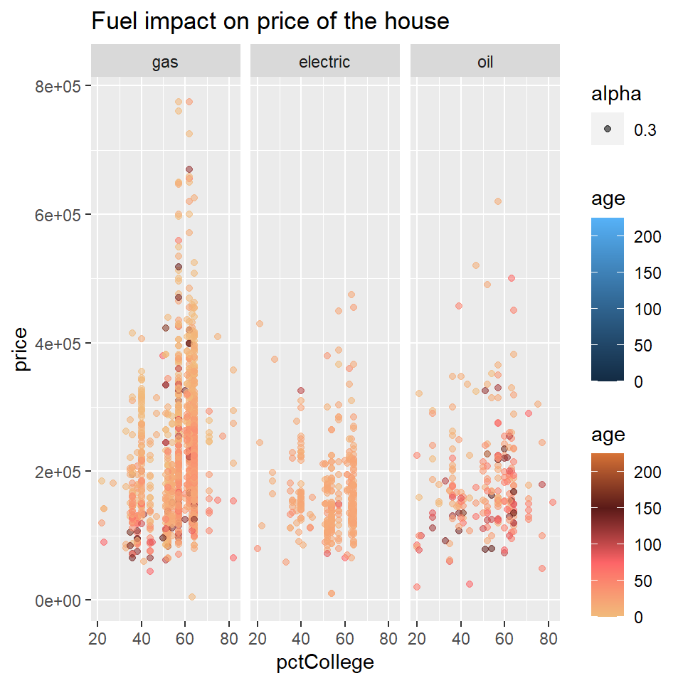
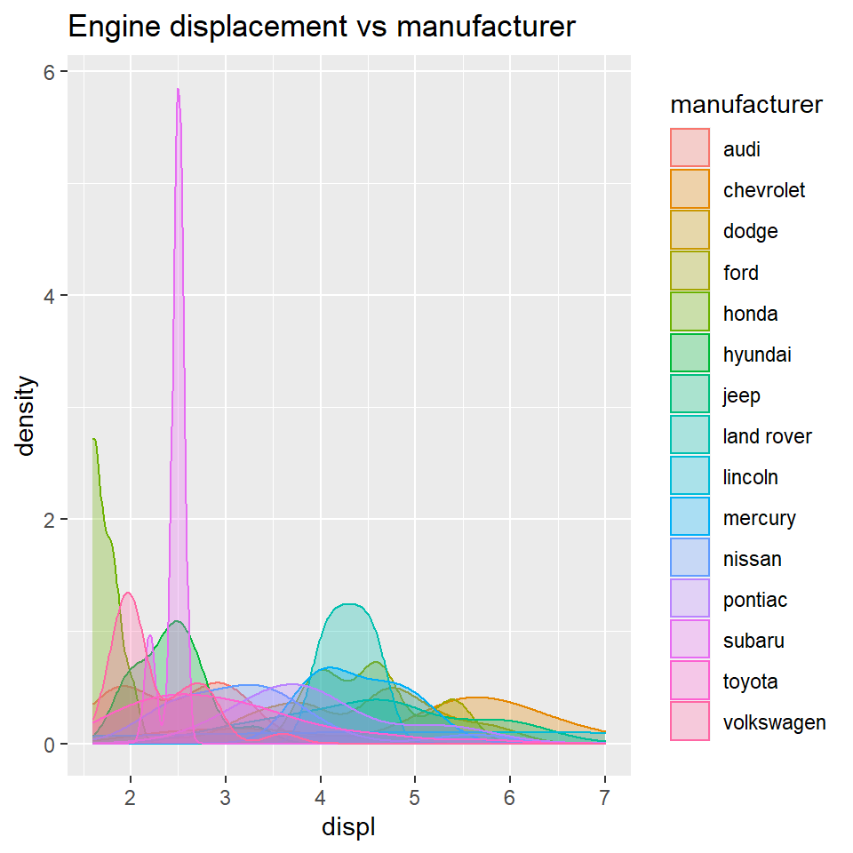

## Introduction

Hi! I'm Sumedha, and the following graphs are from my second workshop at Srishti - Digital thinking tools.  

## Graph 1

Brief introduction of your chosen data set Describe the interesting columns and what they mean


The dataset chosen for this graph is called SaratogaHouses. It contains the data on houses in Saratoga County, New York City in the year 2006.


```
##  [1] "price"           "lotSize"         "age"             "landValue"      
##  [5] "livingArea"      "pctCollege"      "bedrooms"        "fireplaces"     
##  [9] "bathrooms"       "rooms"           "heating"         "fuel"           
## [13] "sewer"           "waterfront"      "newConstruction" "centralAir"
```

```
## Rows: 1,728
## Columns: 16
## $ price           <int> 132500, 181115, 109000, 155000, 86060, 120000, 153000,~
## $ lotSize         <dbl> 0.09, 0.92, 0.19, 0.41, 0.11, 0.68, 0.40, 1.21, 0.83, ~
## $ age             <int> 42, 0, 133, 13, 0, 31, 33, 23, 36, 4, 123, 1, 13, 153,~
## $ landValue       <int> 50000, 22300, 7300, 18700, 15000, 14000, 23300, 14600,~
## $ livingArea      <int> 906, 1953, 1944, 1944, 840, 1152, 2752, 1662, 1632, 14~
## $ pctCollege      <int> 35, 51, 51, 51, 51, 22, 51, 35, 51, 44, 51, 51, 41, 57~
## $ bedrooms        <int> 2, 3, 4, 3, 2, 4, 4, 4, 3, 3, 7, 3, 2, 3, 3, 3, 3, 4, ~
## $ fireplaces      <int> 1, 0, 1, 1, 0, 1, 1, 1, 0, 0, 0, 0, 0, 0, 0, 0, 0, 1, ~
## $ bathrooms       <dbl> 1.0, 2.5, 1.0, 1.5, 1.0, 1.0, 1.5, 1.5, 1.5, 1.5, 1.0,~
## $ rooms           <int> 5, 6, 8, 5, 3, 8, 8, 9, 8, 6, 12, 6, 4, 5, 8, 4, 7, 12~
## $ heating         <fct> electric, hot water/steam, hot water/steam, hot air, h~
## $ fuel            <fct> electric, gas, gas, gas, gas, gas, oil, oil, electric,~
## $ sewer           <fct> septic, septic, public/commercial, septic, public/comm~
## $ waterfront      <fct> No, No, No, No, No, No, No, No, No, No, No, No, No, No~
## $ newConstruction <fct> No, No, No, No, Yes, No, No, No, No, No, No, No, No, N~
## $ centralAir      <fct> No, No, No, No, Yes, No, No, No, No, No, No, No, No, N~
```

Describe briefly what graph you are going to plot

The graph is mainly going to depict the impact of the fuel used on the price of the house. I'm plotting it across the pctCollege rate (percent of neighbourhood that graduated college) as that gives us a sense of the population of the houses in each neighbourhood. 



Brief concluding remarks. What does the graph show? What geometric aesthetics did you use, for example?

Gas seems to be the most popular type of fuel used. That is probably also why it's the most expensive, especially in the neighbourhoods at 40 - 60% pctCollege range, as most of the houses are located there, it's more in demand, which drives the prices up. It's also observed that electric heating is completely out of the picture in the older houses, it's oil and gas that is more in use. 
## Graph 2

Brief introduction of your chosen data set Describe the interesting
columns and what they mean

This was part of one of our group assignments, we created our own datasets based on interactions from a Tv show. We picked Phineas and Ferb, a classic childhood favourtie. 


```
## # A tibble: 16 x 4
##    name                gender personality  num.
##    <chr>               <chr>  <chr>       <dbl>
##  1 Candace             F      Extrovert       1
##  2 Stacy               F      Extrovert       2
##  3 Linda               F      Extrovert       3
##  4 Isabella            F      Extrovert       4
##  5 Phineas             M      Extrovert       5
##  6 Ferb                M      Introvert       6
##  7 Baljeet             M      Introvert       7
##  8 Buford              M      Extrovert       8
##  9 Perry the Platypus  M      Introvert       9
## 10 Major Monogram      M      Extrovert      10
## 11 Jeremy              M      Introvert      11
## 12 Heinz Doofenshmirtz M      Introvert      12
## 13 Adyson Sweetwater   F      Extrovert      13
## 14 Gretchen            F      Extrovert      14
## 15 Karl                M      Introvert      15
## 16 Irving Dubois       M      Extrovert      16
```

```
## # A tibble: 22 x 5
##    from               to             weightage relationship  num.
##    <chr>              <chr>              <dbl> <chr>        <dbl>
##  1 Candace            Stacy                  4 Friends          1
##  2 Candace            Linda                  7 Family           2
##  3 Phineas            Isabella              11 Friends          3
##  4 Phineas            Baljeet                5 Friends          4
##  5 Baljeet            Isabella               2 Friends          5
##  6 Baljeet            Ferb                   1 Friends          6
##  7 Baljeet            Buford                 8 Friends          7
##  8 Phineas            Ferb                   6 Family           8
##  9 Perry the Platypus Major Monogram         2 Professional     9
## 10 Major Monogram     Karl                   2 Professional    10
## # ... with 12 more rows
```

Describe briefly what graph you are going to plot

The graph is an interactive network representing the connections between the characters in the show. You can deduce quite a bit from this, the main characters the story line revolves around, the characters that don't have a lot of screen time, yet play an important role in connecting different story lines together. The interactive part also shows how when you try to pick out one person, you find them hitched to everyone else in the network in some way.


```
## # A tibble: 16 x 4
##    name                gender personality  num.
##    <chr>               <chr>  <chr>       <dbl>
##  1 Candace             F      Extrovert       1
##  2 Stacy               F      Extrovert       2
##  3 Linda               F      Extrovert       3
##  4 Isabella            F      Extrovert       4
##  5 Phineas             M      Extrovert       5
##  6 Ferb                M      Introvert       6
##  7 Baljeet             M      Introvert       7
##  8 Buford              M      Extrovert       8
##  9 Perry the Platypus  M      Introvert       9
## 10 Major Monogram      M      Extrovert      10
## 11 Jeremy              M      Introvert      11
## 12 Heinz Doofenshmirtz M      Introvert      12
## 13 Adyson Sweetwater   F      Extrovert      13
## 14 Gretchen            F      Extrovert      14
## 15 Karl                M      Introvert      15
## 16 Irving Dubois       M      Extrovert      16
```

```
## # A tibble: 22 x 5
##    from               to             weightage relationship  num.
##    <chr>              <chr>              <dbl> <chr>        <dbl>
##  1 Candace            Stacy                  4 Friends          1
##  2 Candace            Linda                  7 Family           2
##  3 Phineas            Isabella              11 Friends          3
##  4 Phineas            Baljeet                5 Friends          4
##  5 Baljeet            Isabella               2 Friends          5
##  6 Baljeet            Ferb                   1 Friends          6
##  7 Baljeet            Buford                 8 Friends          7
##  8 Phineas            Ferb                   6 Family           8
##  9 Perry the Platypus Major Monogram         2 Professional     9
## 10 Major Monogram     Karl                   2 Professional    10
## # ... with 12 more rows
```

```
## # A tibble: 16 x 5
##       id label               group  personality  num.
##    <int> <chr>               <chr>  <chr>       <dbl>
##  1     1 Candace             Female Extrovert       1
##  2     2 Stacy               Female Extrovert       2
##  3     3 Linda               Female Extrovert       3
##  4     4 Isabella            Female Extrovert       4
##  5     5 Phineas             Male   Extrovert       5
##  6     6 Ferb                Male   Introvert       6
##  7     7 Baljeet             Male   Introvert       7
##  8     8 Buford              Male   Extrovert       8
##  9     9 Perry the Platypus  Male   Introvert       9
## 10    10 Major Monogram      Male   Extrovert      10
## 11    11 Jeremy              Male   Introvert      11
## 12    12 Heinz Doofenshmirtz Male   Introvert      12
## 13    13 Adyson Sweetwater   Female Extrovert      13
## 14    14 Gretchen            Female Extrovert      14
## 15    15 Karl                Male   Introvert      15
## 16    16 Irving Dubois       Male   Extrovert      16
```

```
## # A tibble: 22 x 2
##     from    to
##    <int> <int>
##  1     1     2
##  2     1     3
##  3     5     4
##  4     5     7
##  5     7     4
##  6     7     6
##  7     7     8
##  8     5     6
##  9     9    10
## 10    10    15
## # ... with 12 more rows
```


```{=html}
<div id="htmlwidget-b379d61bb3ef7f2c4000" style="width:480px;height:480px;" class="visNetwork html-widget"></div>
<script type="application/json" data-for="htmlwidget-b379d61bb3ef7f2c4000">{"x":{"nodes":{"id":[1,2,3,4,5,6,7,8,9,10,11,12,13,14,15,16],"label":["Candace","Stacy","Linda","Isabella","Phineas","Ferb","Baljeet","Buford","Perry the Platypus","Major Monogram","Jeremy","Heinz Doofenshmirtz","Adyson Sweetwater","Gretchen","Karl","Irving Dubois"],"group":["Female","Female","Female","Female","Male","Male","Male","Male","Male","Male","Male","Male","Female","Female","Male","Male"],"personality":["Extrovert","Extrovert","Extrovert","Extrovert","Extrovert","Introvert","Introvert","Extrovert","Introvert","Extrovert","Introvert","Introvert","Extrovert","Extrovert","Introvert","Extrovert"],"num.":[1,2,3,4,5,6,7,8,9,10,11,12,13,14,15,16]},"edges":{"from":[1,1,5,5,7,7,7,5,9,10,1,5,5,4,4,4,9,5,6,5,4,5],"to":[2,3,4,7,4,6,8,6,10,15,11,8,14,6,8,14,12,9,9,3,16,16]},"nodesToDataframe":true,"edgesToDataframe":true,"options":{"width":"100%","height":"100%","nodes":{"shape":"dot","font":{"size":40}},"manipulation":{"enabled":false},"groups":{"Female":{"shape":"icon","icon":{"code":"f182","size":75,"color":"tomato"},"shadow":{"enabled":true}},"useDefaultGroups":true,"Male":{"shape":"icon","icon":{"code":"f183","size":75,"color":"dodgerblue"},"shadow":{"enabled":true}}},"interaction":{"hover":true,"hoverConnectedEdges":true,"navigationButtons":true,"selectConnectedEdges":true,"zoomView":true,"zoomSpeed":1}},"groups":["Female","Male"],"width":null,"height":null,"idselection":{"enabled":false},"byselection":{"enabled":false},"main":null,"submain":null,"footer":null,"background":"rgba(0, 0, 0, 0)","iconsRedraw":true,"tooltipStay":300,"tooltipStyle":"position: fixed;visibility:hidden;padding: 5px;white-space: nowrap;font-family: verdana;font-size:14px;font-color:#000000;background-color: #f5f4ed;-moz-border-radius: 3px;-webkit-border-radius: 3px;border-radius: 3px;border: 1px solid #808074;box-shadow: 3px 3px 10px rgba(0, 0, 0, 0.2);"},"evals":[],"jsHooks":[]}</script>
```

## Graph 3

Brief introduction of your chosen data set Describe the interesting
columns and what they mean

mpg contains the fuel economy data from 1999 to 2008 for 38 popular models of cars.


```
##  [1] "manufacturer" "model"        "displ"        "year"         "cyl"         
##  [6] "trans"        "drv"          "cty"          "hwy"          "fl"          
## [11] "class"
```

```
## # A tibble: 6 x 11
##   manufacturer model displ  year   cyl trans      drv     cty   hwy fl    class 
##   <chr>        <chr> <dbl> <int> <int> <chr>      <chr> <int> <int> <chr> <chr> 
## 1 audi         a4      1.8  1999     4 auto(l5)   f        18    29 p     compa~
## 2 audi         a4      1.8  1999     4 manual(m5) f        21    29 p     compa~
## 3 audi         a4      2    2008     4 manual(m6) f        20    31 p     compa~
## 4 audi         a4      2    2008     4 auto(av)   f        21    30 p     compa~
## 5 audi         a4      2.8  1999     6 auto(l5)   f        16    26 p     compa~
## 6 audi         a4      2.8  1999     6 manual(m5) f        18    26 p     compa~
```

```
## # A tibble: 6 x 11
##   manufacturer model  displ  year   cyl trans      drv     cty   hwy fl    class
##   <chr>        <chr>  <dbl> <int> <int> <chr>      <chr> <int> <int> <chr> <chr>
## 1 volkswagen   passat   1.8  1999     4 auto(l5)   f        18    29 p     mids~
## 2 volkswagen   passat   2    2008     4 auto(s6)   f        19    28 p     mids~
## 3 volkswagen   passat   2    2008     4 manual(m6) f        21    29 p     mids~
## 4 volkswagen   passat   2.8  1999     6 auto(l5)   f        16    26 p     mids~
## 5 volkswagen   passat   2.8  1999     6 manual(m5) f        18    26 p     mids~
## 6 volkswagen   passat   3.6  2008     6 auto(s6)   f        17    26 p     mids~
```

```
## [1] 234  11
```

```
## [1] FALSE
```

Describe briefly what graph you are going to plot

The graph depicts the engine displacemt for different manufacturers.



## My Course Reflection

This was the one course that I've done here so far where I learnt something completely new. The process and general approach to iterating with questions and graphs was different from the usual, that was really interesting. It also opened my mind to the vast possibilities that come with data science, and understanding the importance of not just having information, but also being able to synthesize and organize it in a way that we can benefit from it, and optimize how much we make use of it. I think it really showed me how little I know and how much there is for me to learn and understand, be it understanding the dataset and asking the right questions or even translating that intuition into code. Overall the classes were really engaging, especially being directly related to the course I've taken, I was really lucky to have been part of this workshop. It gave me some direction on the things I have to focus on to move forward.  
